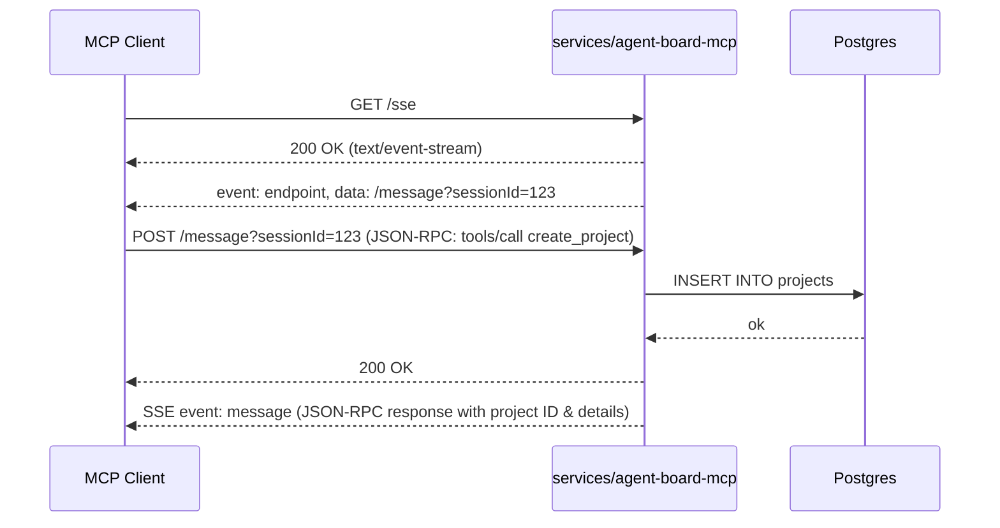

# Architecture — REQ001 agent_board_mcp

**Approval:** approved
**Approved-by:** human
**Approved-at:** 2026-05-15T00:00:00Z

## Scope
- **In:** MCP server implementation over SSE/HTTP. CRUD operations for Projects, Documents, User Stories, and Tasks exposed as standard MCP tools. Data persistence via PostgreSQL. Listing capabilities for AI agents to discover entities.
- **Out:** Authentication/authorization, frontend UI, list pagination, story point estimation logic, rich text formatting validation, user assignment logic.

## Service topology
| Service | New / Modified | Responsibility | Inter-service calls |
|---|---|---|---|
| `services/agent-board-mcp` | new | MCP server, manages Projects, Documents, Stories, Tasks via MCP | — |

## Frontend surface
- **N/A:** No frontend UI. The interface is the MCP protocol itself.

## Data flow



## Components
### Backend
| Service | Package | New / Modified | Responsibility |
|---|---|---|---|
| `services/agent-board-mcp` | `internal/mcp` | new | MCP protocol types, JSON-RPC parsing, SSE stream management |
| `services/agent-board-mcp` | `internal/handler` | new | Echo HTTP endpoints (`GET /sse`, `POST /message`) and MCP tool routing |
| `services/agent-board-mcp` | `internal/domain` | new | Core domain entities (Project, Document, UserStory, Task) |
| `services/agent-board-mcp` | `internal/repo` | new | PostgreSQL queries and CRUD operations |

## Infrastructure
- **Databases:** PostgreSQL (new schema for `agent_board`)
- **Caches / queues:** None
- **External services:** None
- **Env vars added:** `DB_URL` (PostgreSQL connection string), `PORT` (Server port, default 8080)
- **Deployment surface change:** New service deployment.

## API contracts (exact)

The service exposes the Model Context Protocol over HTTP/SSE.
- **SSE Connection:** `GET /sse` (Returns `text/event-stream`, emits `endpoint` event)
- **Message Endpoint:** `POST /message?sessionId={id}` (Receives JSON-RPC requests, responds 200 OK)

### MCP Tools JSON Schemas

When a client sends a JSON-RPC request for `tools/call`, the `params.arguments` object must match the **Request** schemas below. 

The server responds with a JSON-RPC response where `result.content` contains a text block. The **Response** schemas below define the JSON structure that will be serialized into the `text` field of the successful tool result. For validation or not-found errors, the server returns `isError: true` with a descriptive string in the text block.

#### Project Tools

**`create_project`**
- **Request (Arguments):**
  ```json
  {
    "name": "string (min 1)",
    "description": "string (optional)"
  }
  ```
- **Response (Result Content JSON):**
  ```json
  {
    "id": "string (uuid)",
    "name": "string",
    "description": "string",
    "createdAt": "string (iso8601)",
    "updatedAt": "string (iso8601)"
  }
  ```

**`get_project`**
- **Request (Arguments):**
  ```json
  {
    "id": "string (uuid)"
  }
  ```
- **Response (Result Content JSON):**
  ```json
  {
    "id": "string (uuid)",
    "name": "string",
    "description": "string",
    "createdAt": "string (iso8601)",
    "updatedAt": "string (iso8601)"
  }
  ```

**`update_project`**
- **Request (Arguments):**
  ```json
  {
    "id": "string (uuid)",
    "name": "string (optional)",
    "description": "string (optional)"
  }
  ```
- **Response (Result Content JSON):**
  ```json
  {
    "id": "string (uuid)",
    "name": "string",
    "description": "string",
    "createdAt": "string (iso8601)",
    "updatedAt": "string (iso8601)"
  }
  ```

**`delete_project`**
- **Request (Arguments):**
  ```json
  {
    "id": "string (uuid)"
  }
  ```
- **Response (Result Content JSON):**
  ```json
  {
    "success": true
  }
  ```

**`list_projects`**
- **Request (Arguments):**
  ```json
  {}
  ```
- **Response (Result Content JSON):**
  ```json
  {
    "projects": [
      {
        "id": "string (uuid)",
        "name": "string",
        "description": "string",
        "createdAt": "string (iso8601)",
        "updatedAt": "string (iso8601)"
      }
    ]
  }
  ```

#### Document Tools

**`create_document`**
- **Request (Arguments):**
  ```json
  {
    "projectId": "string (uuid)",
    "title": "string (min 1)",
    "content": "string"
  }
  ```
- **Response (Result Content JSON):**
  ```json
  {
    "id": "string (uuid)",
    "projectId": "string (uuid)",
    "title": "string",
    "content": "string",
    "createdAt": "string (iso8601)",
    "updatedAt": "string (iso8601)"
  }
  ```

**`get_document`**
- **Request (Arguments):**
  ```json
  {
    "id": "string (uuid)"
  }
  ```
- **Response (Result Content JSON):**
  ```json
  {
    "id": "string (uuid)",
    "projectId": "string (uuid)",
    "title": "string",
    "content": "string",
    "createdAt": "string (iso8601)",
    "updatedAt": "string (iso8601)"
  }
  ```

**`update_document`**
- **Request (Arguments):**
  ```json
  {
    "id": "string (uuid)",
    "title": "string (optional)",
    "content": "string (optional)"
  }
  ```
- **Response (Result Content JSON):**
  ```json
  {
    "id": "string (uuid)",
    "projectId": "string (uuid)",
    "title": "string",
    "content": "string",
    "createdAt": "string (iso8601)",
    "updatedAt": "string (iso8601)"
  }
  ```

**`delete_document`**
- **Request (Arguments):**
  ```json
  {
    "id": "string (uuid)"
  }
  ```
- **Response (Result Content JSON):**
  ```json
  {
    "success": true
  }
  ```

**`list_documents`**
- **Request (Arguments):**
  ```json
  {
    "projectId": "string (uuid)"
  }
  ```
- **Response (Result Content JSON):**
  ```json
  {
    "documents": [
      {
        "id": "string (uuid)",
        "projectId": "string (uuid)",
        "title": "string",
        "content": "string",
        "createdAt": "string (iso8601)",
        "updatedAt": "string (iso8601)"
      }
    ]
  }
  ```

#### User Story Tools

**`create_user_story`**
- **Request (Arguments):**
  ```json
  {
    "projectId": "string (uuid)",
    "title": "string (min 1)",
    "description": "string",
    "status": "string (draft|in_development|in_signoff|done)"
  }
  ```
- **Response (Result Content JSON):**
  ```json
  {
    "id": "string (uuid)",
    "projectId": "string (uuid)",
    "title": "string",
    "description": "string",
    "status": "string",
    "createdAt": "string (iso8601)",
    "updatedAt": "string (iso8601)"
  }
  ```

**`get_user_story`**
- **Request (Arguments):**
  ```json
  {
    "id": "string (uuid)"
  }
  ```
- **Response (Result Content JSON):**
  ```json
  {
    "id": "string (uuid)",
    "projectId": "string (uuid)",
    "title": "string",
    "description": "string",
    "status": "string",
    "createdAt": "string (iso8601)",
    "updatedAt": "string (iso8601)"
  }
  ```

**`update_user_story`**
- **Request (Arguments):**
  ```json
  {
    "id": "string (uuid)",
    "title": "string (optional)",
    "description": "string (optional)",
    "status": "string (optional)"
  }
  ```
- **Response (Result Content JSON):**
  ```json
  {
    "id": "string (uuid)",
    "projectId": "string (uuid)",
    "title": "string",
    "description": "string",
    "status": "string",
    "createdAt": "string (iso8601)",
    "updatedAt": "string (iso8601)"
  }
  ```

**`delete_user_story`**
- **Request (Arguments):**
  ```json
  {
    "id": "string (uuid)"
  }
  ```
- **Response (Result Content JSON):**
  ```json
  {
    "success": true
  }
  ```

**`list_user_stories`**
- **Request (Arguments):**
  ```json
  {
    "projectId": "string (uuid)"
  }
  ```
- **Response (Result Content JSON):**
  ```json
  {
    "userStories": [
      {
        "id": "string (uuid)",
        "projectId": "string (uuid)",
        "title": "string",
        "description": "string",
        "status": "string",
        "createdAt": "string (iso8601)",
        "updatedAt": "string (iso8601)"
      }
    ]
  }
  ```

#### Task Tools

**`create_task`**
- **Request (Arguments):**
  ```json
  {
    "userStoryId": "string (uuid)",
    "title": "string (min 1)",
    "description": "string",
    "status": "string (pending|in_progress|in_review|completed)"
  }
  ```
- **Response (Result Content JSON):**
  ```json
  {
    "id": "string (uuid)",
    "userStoryId": "string (uuid)",
    "title": "string",
    "description": "string",
    "status": "string",
    "createdAt": "string (iso8601)",
    "updatedAt": "string (iso8601)"
  }
  ```

**`get_task`**
- **Request (Arguments):**
  ```json
  {
    "id": "string (uuid)"
  }
  ```
- **Response (Result Content JSON):**
  ```json
  {
    "id": "string (uuid)",
    "userStoryId": "string (uuid)",
    "title": "string",
    "description": "string",
    "status": "string",
    "createdAt": "string (iso8601)",
    "updatedAt": "string (iso8601)"
  }
  ```

**`update_task`**
- **Request (Arguments):**
  ```json
  {
    "id": "string (uuid)",
    "title": "string (optional)",
    "description": "string (optional)",
    "status": "string (optional)"
  }
  ```
- **Response (Result Content JSON):**
  ```json
  {
    "id": "string (uuid)",
    "userStoryId": "string (uuid)",
    "title": "string",
    "description": "string",
    "status": "string",
    "createdAt": "string (iso8601)",
    "updatedAt": "string (iso8601)"
  }
  ```

**`delete_task`**
- **Request (Arguments):**
  ```json
  {
    "id": "string (uuid)"
  }
  ```
- **Response (Result Content JSON):**
  ```json
  {
    "success": true
  }
  ```

**`list_tasks`**
- **Request (Arguments):**
  ```json
  {
    "userStoryId": "string (uuid)"
  }
  ```
- **Response (Result Content JSON):**
  ```json
  {
    "tasks": [
      {
        "id": "string (uuid)",
        "userStoryId": "string (uuid)",
        "title": "string",
        "description": "string",
        "status": "string",
        "createdAt": "string (iso8601)",
        "updatedAt": "string (iso8601)"
      }
    ]
  }
  ```

## Data model

### PostgreSQL Schema
```sql
CREATE TABLE projects (
    id UUID PRIMARY KEY DEFAULT gen_random_uuid(),
    name VARCHAR(255) NOT NULL,
    description TEXT,
    created_at TIMESTAMPTZ NOT NULL DEFAULT NOW(),
    updated_at TIMESTAMPTZ NOT NULL DEFAULT NOW()
);

CREATE TABLE documents (
    id UUID PRIMARY KEY DEFAULT gen_random_uuid(),
    project_id UUID NOT NULL REFERENCES projects(id) ON DELETE CASCADE,
    title VARCHAR(255) NOT NULL,
    content TEXT,
    created_at TIMESTAMPTZ NOT NULL DEFAULT NOW(),
    updated_at TIMESTAMPTZ NOT NULL DEFAULT NOW()
);
CREATE INDEX idx_documents_project_id ON documents(project_id);

CREATE TABLE user_stories (
    id UUID PRIMARY KEY DEFAULT gen_random_uuid(),
    project_id UUID NOT NULL REFERENCES projects(id) ON DELETE CASCADE,
    title VARCHAR(255) NOT NULL,
    description TEXT,
    status VARCHAR(50) NOT NULL,
    created_at TIMESTAMPTZ NOT NULL DEFAULT NOW(),
    updated_at TIMESTAMPTZ NOT NULL DEFAULT NOW()
);
CREATE INDEX idx_user_stories_project_id ON user_stories(project_id);

CREATE TABLE tasks (
    id UUID PRIMARY KEY DEFAULT gen_random_uuid(),
    user_story_id UUID NOT NULL REFERENCES user_stories(id) ON DELETE CASCADE,
    title VARCHAR(255) NOT NULL,
    description TEXT,
    status VARCHAR(50) NOT NULL,
    created_at TIMESTAMPTZ NOT NULL DEFAULT NOW(),
    updated_at TIMESTAMPTZ NOT NULL DEFAULT NOW()
);
CREATE INDEX idx_tasks_user_story_id ON tasks(user_story_id);
```

## Key decisions (ADR-lite)

### D-001 — Using MCP over SSE
- **Context:** We need a standardized way for AI agents to interact with the project board.
- **Decision:** Implement the Model Context Protocol (MCP) using the SSE/HTTP transport with Go Echo.
- **Alternatives rejected:** Stdio transport (unsuitable for a network-exposed service), standard REST APIs (would not comply natively with the MCP ecosystem).
- **Consequences:** We must manage persistent SSE connections and ensure JSON-RPC messages are correctly routed to active sessions.

### D-002 — Cascading Deletes via PostgreSQL
- **Context:** Deleting a Project should recursively remove Documents and User Stories, and deleting a User Story should remove its Tasks.
- **Decision:** Use `ON DELETE CASCADE` at the DB level.
- **Alternatives rejected:** Application-level cascading (requires multiple queries, complex logic, and risks data inconsistency).
- **Consequences:** Simplifies backend handlers; database handles consistency guarantees automatically.

### D-003 — Handling SSE Concurrency and Scaling
- **Context:** High concurrent SSE connections could strain server memory, as each connection natively blocks an underlying OS thread / HTTP goroutine. We need an approach that scales.
- **Decision:** We will retain SSE to comply strictly with the official MCP transport specification, but we will manage connections efficiently within a bounded in-memory manager in Go. Go's lightweight goroutines are highly efficient for keeping thousands of idle SSE connections open simultaneously per instance with minimal memory footprint (a few KB per connection). Should we require horizontal scaling across multiple instances later, we will integrate a Redis Pub/Sub backplane as a lightweight event bus to route server-to-client MCP messages to the correct node holding the client's SSE session.
- **Alternatives rejected:** WebSockets (rejected as MCP standard explicitly defines SSE for HTTP-based interactions, and we do not want to deviate from the protocol standard).
- **Consequences:** We maintain complete MCP specification compliance while relying on Go's runtime efficiency for initial scale. The introduction of Redis is deferred until horizontal scaling proves necessary.

## Cross-cutting
- **Config / env vars:** `PORT`, `DB_URL`
- **Error model:** Standard MCP responses. Domain/validation errors return an MCP Tool Result with `isError: true` and the error description in text.
- **Observability:** HTTP request logging using standard Echo middleware.

## Risks & open questions
- **Risk:** Unbounded listing could retrieve too many records. (Mitigation: If scale increases, we may need to introduce pagination in a future iteration. Current scope explicitly excludes pagination.)

## Approval log
### Revision 1 — 2024-05-15 — author: system-architect
- Initial draft.

### Revision 2 — 2024-05-16 — driver: human feedback pass 1
- Added `list_projects`, `list_documents`, `list_user_stories`, and `list_tasks` tools to enable agent entity discovery.
- Added `D-003` to address SSE concurrency scaling (relying on Go's goroutines with future Redis event bus if needed, rejecting WebSockets to maintain MCP protocol adherence).

### Revision 3 — 2026-05-15 — driver: human approval
- Approved by human at 2026-05-15T00:00:00Z.
