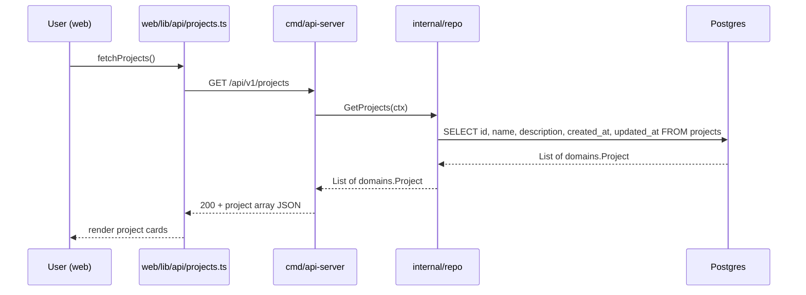

# Architecture — REQ002 dashboard

**Approval:** pending_approval
**Approved-by:** 
**Approved-at:** 

## Scope
- **In:** A web-based dashboard displaying a read-only list of available projects in a card UI. Adding a new standard REST endpoint to the existing backend to serve this data via a dedicated API server executable.
- **Out:** Project creation, editing, deletion. Project details view. Filtering, sorting, and pagination. Authentication.

## Service topology
| Service | New / Modified | Responsibility | Inter-service calls |
|---|---|---|---|
| `services/agent-board` | modified | Mono-repo module containing two executables: `mcp-server` (existing AI logic) and `api-server` (new REST API for frontend). Shared domain/repo logic in `internal/`. | — |

## Frontend surface
| Route (`web/pages/...`) | New / Modified | Owns these user actions | Backend endpoints used |
|---|---|---|---|
| `/` | new | view list of projects | `GET /api/v1/projects` |

- **API client layer:** `web/lib/api/` — every backend call lives here; components never call `fetch` directly. Mock at this boundary in tests via MSW.

## Data flow


## Components
### Backend
| Service | Package | New / Modified | Responsibility |
|---|---|---|---|
| `services/agent-board` | `cmd/api-server` | new | Entry point for the REST API (Dashboard service). Enables CORS. Handles HTTP requests using Echo. |
| `services/agent-board` | `cmd/mcp-server` | new | Entry point for the MCP service. Migrated from `cmd/agent-board-mcp`. |
| `services/agent-board` | `internal/handler` | new | REST HTTP handlers for `api-server`. |
| `services/agent-board` | `internal/repo` | modified | Shared data access logic used by both `api-server` and `mcp-server`. |

### Frontend
| Group | Path | Responsibility |
|---|---|---|
| Pages | `web/pages/index.tsx` | route component (CSR only), displays the dashboard |
| Components | `web/components/Dashboard/ProjectList.tsx` | UI building block for the grid of cards |
| Components | `web/components/Dashboard/ProjectCard.tsx` | UI building block for a single project |
| Hooks | `web/hooks/useProjects.ts` | data fetching state management (loading, error, data) |
| API client | `web/lib/api/projects.ts` | typed wrapper around backend endpoints |
| Types | `web/lib/api/types.ts` | shared TypeScript interfaces reflecting API contracts |

## Infrastructure
- **Databases:** Existing Postgres DB for `agent-board`. Both `mcp-server` and `api-server` connect to this same database instance.
- **Caches / queues:** None.
- **External services:** None.
- **Env vars added:** `NEXT_PUBLIC_API_BASE_URL` (e.g. `http://localhost:8080`) for FE.
- **CORS:** The `api-server` must have CORS middleware enabled to allow requests from the Next.js frontend origin.
- **Deployment surface change:** We will now build and deploy two distinct binaries (`mcp-server` and `api-server`) from the same Go module. The `api-server` exposes standard HTTP REST routes.

## API contracts (exact)

### GET /api/v1/projects
- **Service:** `services/agent-board` (`api-server` executable)
- **Auth:** None
- **Request body:** None
- **Responses:**
  - **200 OK** — Successfully retrieved projects list:
    ```json
    {
      "projects": [
        {
          "id": "123e4567-e89b-12d3-a456-426614174000",
          "name": "E-commerce Website",
          "description": "A new online store for electronics",
          "createdAt": "2023-10-25T10:00:00Z",
          "updatedAt": "2023-10-25T10:00:00Z"
        }
      ]
    }
    ```
  - **500 Internal Server Error** — Database or server failure:
    ```json
    {
      "code": "INTERNAL_ERROR",
      "message": "Failed to fetch projects"
    }
    ```
- **Idempotency:** Yes (safe GET request).

## Data model
No changes to the existing database schema. Both applications read from the existing `projects` table.

## Key decisions (ADR-lite)
### D-001 — Split Application Entrypoints (mcp-server and api-server)
- **Context:** The frontend needs to fetch a list of projects via REST, while AI agents continue to use the MCP SSE server. The existing codebase has a single entrypoint (`cmd/agent-board-mcp/main.go`).
- **Decision:** Restructure `services/agent-board` to contain two executables: `cmd/mcp-server` for the MCP protocol and `cmd/api-server` for the REST API. Both share the `internal/` package for domain logic and data access.
- **Alternatives rejected:** 
  - Host both MCP and REST on a single port/executable: increases coupling and risk. MCP server has a very specific operational footprint (long-lived SSE connections, tool execution) compared to a typical stateless UI backend.
  - Create a completely new microservice `services/dashboard-api`: rejected as it would duplicate the data access code and data models for a very small read-only requirement.
- **Consequences:** We must update build scripts and CI/CD (or local testing scripts) to start/build two binaries instead of one. The `internal` packages must be clean of MCP or REST specific dependencies so they can be consumed by both.

## Cross-cutting
- **Config / env vars:** Both servers will need `DATABASE_URL`. The `api-server` needs PORT (default 8080) and `FRONTEND_URL` for CORS configuration.
- **Logging keys:** Standardized logging. Differentiate between `mcp-server` and `api-server` instances.
- **Metrics:** No specific changes.
- **Error model:** Standardized JSON error response with `code` and `message` for the REST API.
- **Observability:** Existing Echo request logging will capture REST API requests in the new `api-server`.

## Risks & open questions
- **Deployment:** The orchestrator/user running tests or deployments will need to ensure both `mcp-server` and `api-server` are built and running. This may require updates to `US001_mcp_server_setup.robot` or a new test setup task to run the API server.

## Approval log
### Revision 4 — 2026-05-15 — driver: human approval
- Approved by human at 2026-05-15T10:35:00Z.

### Revision 3 — 2026-05-15 — driver: human feedback pass 2
- Renamed the service directory from `services/agent-board-mcp` to `services/agent-board` to better reflect its broadened scope encompassing both the MCP server and REST API backend.

### Revision 2 — 2024-05-24 — driver: human feedback pass 1
- Refactored architecture to split the single application into two separate executables (`mcp-server` and `api-server`) within the single Go module.
- Clarified that `internal/repo` is the shared layer for database access.
- Added explicit D-001 ADR-lite decision for the binary split.
- Confirmed CORS requirement and no authentication for the REST API.

### Revision 1 — 2024-05-24 — author: system-architect
- Initial draft.
