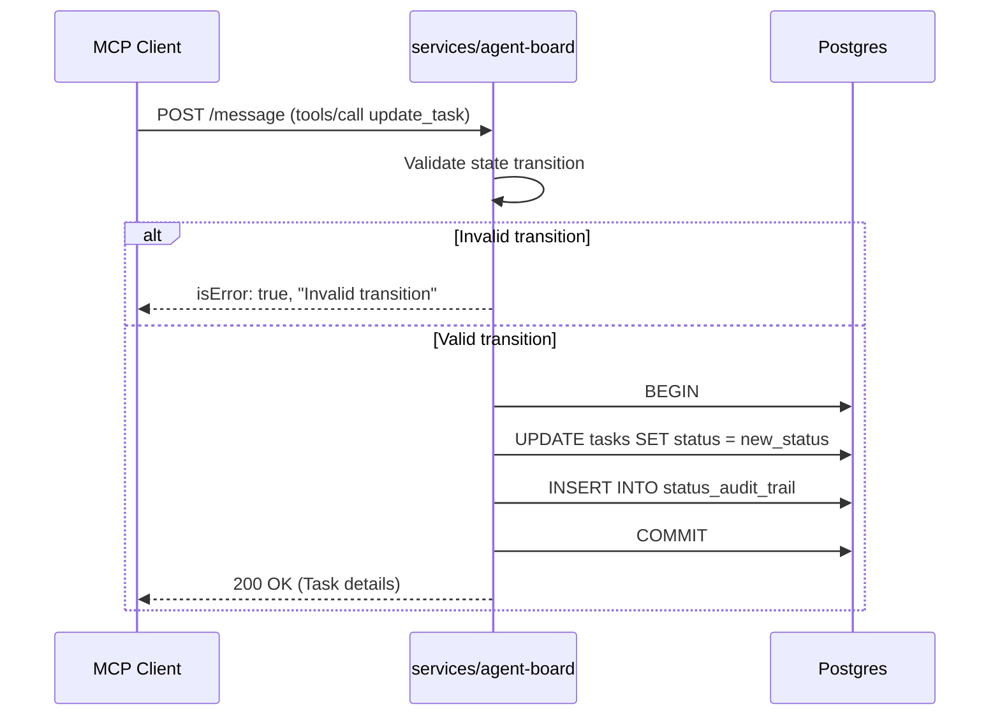

# Architecture — REQ003 status_state_machine

**Approval:** approved
**Approved-by:** human
**Approved-at:** 2026-05-18T11:46:16Z

## Scope
- **In:** Enforce exact state machines for Task and User Story statuses. Reject invalid transitions on updates. Enforce initial states on creation. Track all status changes in a persistent audit trail. Provide MCP tools to retrieve the audit trail.
- **Out:** Cascading state changes (e.g., tasks do not automatically update story state). Tracking non-status changes. Any UI updates (operations are exposed purely via MCP APIs).

## Service topology
| Service | New / Modified | Responsibility | Inter-service calls |
|---|---|---|---|
| `services/agent-board` | modified | Enforce state machines, validate state transitions, record and serve audit logs via MCP tools | — |

## Frontend surface
| Route (`web/pages/...`) | New / Modified | Owns these user actions | Backend endpoints used |
|---|---|---|---|
| N/A | unchanged | No UI required for this requirement | N/A |

- **API client layer:** No frontend changes needed. All operations are exposed via backend MCP tools.

## Data flow
When an MCP client updates a status, the backend validates the transition, updates the entity, and writes an audit log atomically.



## Components
### Backend
| Service | Package | New / Modified | Responsibility |
|---|---|---|---|
| `services/agent-board` | `internal/domain` | modified | Add state machine transition rules and validation methods (`IsValidTransition`). Define `StatusAuditLog` entity. |
| `services/agent-board` | `internal/repo` | modified | Add transactional support for updating status and inserting audit logs simultaneously. Add methods to query audit logs. |
| `services/agent-board` | `internal/handler` | modified | Call transition validation before updates. Add new MCP tools `get_task_audit_trail` and `get_user_story_audit_trail`. |

### Frontend
No frontend changes.

## Infrastructure
- **Databases (per service):** PostgreSQL schema modified to add `status_audit_trail`.
- **Caches / queues:** None.
- **External services:** None.
- **Env vars added:** None.
- **CORS:** Unchanged.
- **Deployment surface change:** Unchanged.

## API contracts (exact)

The existing MCP tools `update_task` and `update_user_story` will now return errors if the status transition is invalid.
If `isError: true` is returned, the text response should be descriptive (e.g., `"Invalid transition from pending to completed"`).

For `create_task` and `create_user_story`, providing an invalid initial status (`pending` for tasks, `draft` for stories) will result in validation errors or defaulting to the correct state.

### New MCP Tools

#### `get_task_audit_trail`
- **Request (Arguments):**
  ```json
  {
    "taskId": "string (uuid)"
  }
  ```
- **Response (Result Content JSON):**
  ```json
  {
    "auditTrail": [
      {
        "id": "string (uuid)",
        "entityId": "string (uuid)",
        "entityType": "string (always 'task')",
        "fromStatus": "string",
        "toStatus": "string",
        "changedAt": "string (iso8601)"
      }
    ]
  }
  ```

#### `get_user_story_audit_trail`
- **Request (Arguments):**
  ```json
  {
    "userStoryId": "string (uuid)"
  }
  ```
- **Response (Result Content JSON):**
  ```json
  {
    "auditTrail": [
      {
        "id": "string (uuid)",
        "entityId": "string (uuid)",
        "entityType": "string (always 'user_story')",
        "fromStatus": "string",
        "toStatus": "string",
        "changedAt": "string (iso8601)"
      }
    ]
  }
  ```

## Data model

### New PostgreSQL Schema (Migration)
```sql
CREATE TABLE status_audit_trail (
    id UUID PRIMARY KEY DEFAULT gen_random_uuid(),
    entity_id UUID NOT NULL,
    entity_type VARCHAR(50) NOT NULL, -- 'task' or 'user_story'
    from_status VARCHAR(50) NOT NULL,
    to_status VARCHAR(50) NOT NULL,
    changed_at TIMESTAMPTZ NOT NULL DEFAULT NOW()
);

-- Index for efficient chronological querying of audit trails per entity
CREATE INDEX idx_status_audit_trail_entity ON status_audit_trail(entity_type, entity_id, changed_at ASC);
```

## Key decisions (ADR-lite)
### D-001 — Domain-driven state transition validation
- **Context:** We need to strictly enforce task and story state machines.
- **Decision:** Place the state machine validation logic within the `internal/domain` package.
- **Alternatives rejected:** Validating in the database using triggers (harder to maintain and test), or in the HTTP/MCP handler directly (leaks business logic into transport layer).
- **Consequences:** Business rules are easily testable in unit tests without database mocks.

### D-002 — Polymorphic Audit Table
- **Context:** We need to track status changes for both Tasks and User Stories.
- **Decision:** Create a single `status_audit_trail` table with an `entity_type` column rather than separate tables (`task_audit_logs`, `story_audit_logs`).
- **Alternatives rejected:** Separate tables for each entity type (adds unnecessary schema boilerplate).
- **Consequences:** Simplifies schema management and allows adding future entities to the audit trail with zero schema changes.

### D-003 — Atomicity of Updates and Audits
- **Context:** We must ensure an audit log is always created when a status changes.
- **Decision:** Enforce that the primary entity update and the audit log insertion occur within the same PostgreSQL transaction in the `internal/repo` layer.
- **Alternatives rejected:** Event-driven async logging (overkill for this scale and risks losing logs if the process crashes between the DB update and event publishing).
- **Consequences:** Slight increase in update latency due to transaction, but guarantees strict data consistency.

## Cross-cutting
- **Config / env vars:** None.
- **Logging keys:** Log `entity_type`, `entity_id`, `from_status`, and `to_status` on state transition attempts (both successful and failed).
- **Metrics:** None.
- **Error model:** Standard MCP responses with `isError: true` for invalid transitions.
- **Observability:** None additional.

## Risks & open questions
- **Risk:** High frequency of status updates could bloat the `status_audit_trail` table over time. (Mitigation: Data volume for agent tasks/stories is expected to be low enough that PostgreSQL can handle it indefinitely without partitioning.)

## Approval log
### Revision 1 — YYYY-MM-DD — author: system-architect
- Initial draft.
### Revision 2 — 2026-05-18 — driver: human approval
- Approved by human at 2026-05-18T11:46:16Z.
