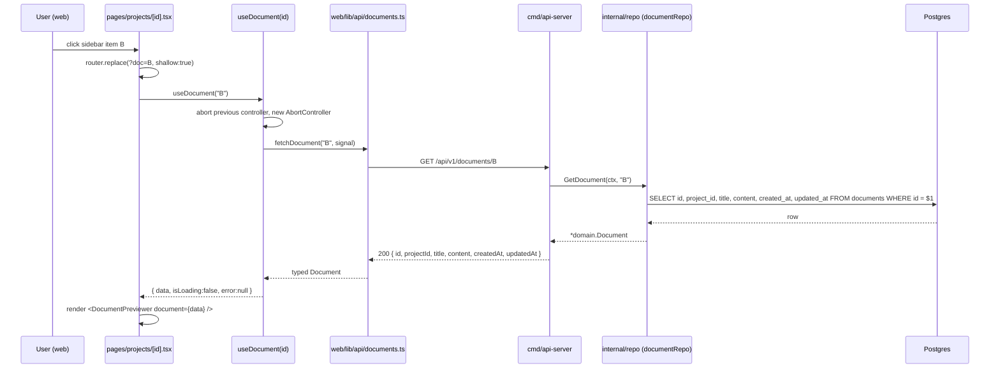

# Architecture — REQ004 project_detail_page

**Approval:** approved
**Approved-by:** human
**Approved-at:** 2026-05-20T07:17:32Z

## Scope
- **In:**
  - Three new read-only REST endpoints on the existing `api-server` in `services/agent-board`:
    - `GET /api/v1/projects/{projectId}` — single project (header).
    - `GET /api/v1/projects/{projectId}/documents` — document list metadata (sidebar).
    - `GET /api/v1/documents/{documentId}` — single document including markdown `content` (previewer).
  - New CSR-only Next.js Pages Router route `/projects/[id]` with a two-tab shell (Documents / User Stories), tab + selected-document state persisted in the URL query string (`?tab=`, `?doc=`).
  - Making the existing `web/components/Dashboard/ProjectCard.tsx` keyboard-accessible and clickable so each card navigates to `/projects/{id}`.
  - A markdown previewer that renders GFM + syntax-highlighted code fences + mermaid diagrams (lazy-loaded SVG), with HTML sanitization.
  - Race-safe document selection (rapid clicks always end with the most-recently-selected document showing).
  - In-pane error isolation for the document content fetch (sidebar stays usable).
- **Out:**
  - Creating, editing, or deleting documents from the UI (still MCP-only).
  - Real content for the User Stories tab (placeholder string only).
  - Document search / filter / pagination / grouping / version history / export.
  - KaTeX / math rendering, custom directives, footnotes, GFM alerts.
  - Auth, sharing, permissions.
  - Mobile-specific responsive polish (desktop-first).
  - Any schema changes to existing tables (read-only access to `documents` + `projects`).

## Service topology
| Service | New / Modified | Responsibility | Inter-service calls |
|---|---|---|---|
| `services/agent-board` (`cmd/api-server`) | modified | Adds three GET handlers under the existing Echo router. Reuses existing `internal/repo` (project + document) and `internal/domain`. No new service, no new module. | — |
| `services/agent-board` (`cmd/mcp-server`) | untouched | — | — |

No new internal packages required. The new HTTP handlers live in `internal/handler/` alongside the existing `project_handler.go`. The existing `repo.ProjectRepository.GetProject(ctx, id)` and `repo.DocumentRepository.GetDocument(ctx, id)` / `ListDocuments(ctx, projectID)` interfaces already exist and cover every read-path this requirement needs.

## Frontend surface
| Route (`web/pages/...`) | New / Modified | Owns these user actions | Backend endpoints used |
|---|---|---|---|
| `/` (`web/pages/index.tsx`) | modified | dashboard list — each `ProjectCard` becomes a link to `/projects/{id}` | (unchanged) |
| `/projects/[id]` (`web/pages/projects/[id].tsx`) | new | view project header; switch between Documents / User Stories tab; select document; deep-link via `?tab=` and `?doc=` | `GET /api/v1/projects/{id}`, `GET /api/v1/projects/{id}/documents`, `GET /api/v1/documents/{id}` |

- **API client layer:** `web/lib/api/` — every backend call lives here. Two new modules:
  - `web/lib/api/projects.ts` (existing — extend with `fetchProject(id)`).
  - `web/lib/api/documents.ts` (new — `fetchProjectDocuments(projectId)` and `fetchDocument(documentId)`).
  - Both wrap the existing `fetchClient` in `web/lib/api/client.ts`, which already normalizes the `{ code, message }` error envelope into `ApiError`.
- All three new endpoints are exposed to MSW as new handlers under `web/test/msw/handlers.ts`. Bundle import notes (mermaid lazy-load, see §"Markdown rendering plan") are FE-only.

### State strategy

- **URL is source of truth for navigation state.** `useRouter().query` provides:
  - `id` — path param (project id).
  - `tab` — `'documents'` (default when absent or unrecognized) or `'user-stories'`.
  - `doc` — selected document id (only meaningful when `tab === 'documents'`).
- **Tab changes** are written with `router.replace({ query: {...query, tab: 'user-stories'} }, undefined, { shallow: true })` so we don't re-trigger page-level data fetches.
- **Document selection** is written the same way (shallow replace with `doc`). Clicking a document also triggers the content fetch.
- **Auto-selection:** when `tab === 'documents'`, the list resolves non-empty, and `doc` is absent (or refers to a document that isn't in the list), the page auto-selects the first list item by issuing a shallow `router.replace` with `doc=<first.id>`. The "deep-link to bogus doc" AC is satisfied by detecting that `doc` is set but is not in the list — in that case do NOT auto-select; show "Document not found" in the previewer instead.
- **Race-cancellation pattern:** the document-content fetch uses `AbortController`. The `useDocument(documentId)` hook keeps a ref to the current controller, aborts it before issuing the next fetch, and ignores the result if the in-flight request's id no longer matches the latest selected `documentId`. (Belt-and-braces: abort + stale-id check. This satisfies the US013 AC "clicking a different sidebar item while loading cancels/supersedes the in-flight fetch.")
- **Dashboard card click wiring:** `ProjectCard` becomes a Next `<Link href={\`/projects/${project.id}\`}>` wrapping the existing `<article>` content. The article retains its visual classes; the Link supplies focusability, Enter activation, and right-click/middle-click correctness for free. `role="link"` is implicit; `aria-label` set to the project name.

## Data flow

A representative content-fetch lifecycle on the Documents tab:



If the user clicks document C before B's response arrives, the hook aborts B's request, issues C's request, and ignores any late B response. If C's request fails (network or 5xx), the previewer renders an in-pane error with Retry; the sidebar stays interactive.

## Components

### Backend
| Service | Package | New / Modified | Responsibility |
|---|---|---|---|
| `services/agent-board` | `internal/handler/project_handler.go` | modified | Add `GetProject(c echo.Context) error` — single project by path id; uses `repo.ProjectRepository.GetProject` and returns the existing project JSON shape; maps `repo.ErrNotFound` → 404 with `{ code: "NOT_FOUND", ... }`. |
| `services/agent-board` | `internal/handler/document_handler.go` | new | Two handlers: `ListProjectDocuments(c)` — calls `repo.DocumentRepository.ListDocuments(ctx, projectID)`, sorts by `updatedAt` desc in SQL (see §"Data access"), returns list of metadata (no `content`); `GetDocument(c)` — calls `repo.DocumentRepository.GetDocument` and returns the full document JSON. Both map `repo.ErrNotFound` → 404 / generic errors → 500 using the shared envelope. |
| `services/agent-board` | `cmd/api-server/main.go` | modified | Register the three new routes on the existing Echo instance: `e.GET("/api/v1/projects/:id", projectHandler.GetProject)`, `e.GET("/api/v1/projects/:id/documents", documentHandler.ListProjectDocuments)`, `e.GET("/api/v1/documents/:id", documentHandler.GetDocument)`. Construct `documentHandler` with `repo.NewDocumentRepo(db)`. |
| `services/agent-board` | `internal/repo/document_repo.go` | modified | `ListDocuments` SQL changes from `ORDER BY created_at DESC` to `ORDER BY updated_at DESC, id DESC`. (`id DESC` is a stable tiebreaker for documents whose `updated_at` collide at insert time.) No interface change. |
| `services/agent-board` | `internal/repo/project_repo.go` | untouched | `GetProject(ctx, id)` already exists and is sufficient. |

### Frontend
| Group | Path | New / Modified | Responsibility |
|---|---|---|---|
| Pages | `web/pages/projects/[id].tsx` | new | CSR-only page; reads `id`, `tab`, `doc` from `useRouter().query`; orchestrates the three hooks; renders header / tab switcher / tab content. Handles 404/5xx for the project fetch with full-page "Project not found" / "Failed to load project" states (sibling to the tab switcher, which is hidden in those states). |
| Components | `web/components/ProjectDetail/ProjectHeader.tsx` | new | Renders `<h1>{name}</h1>` + description / "No description" / skeleton, plus the "Back to dashboard" `<Link>`. |
| Components | `web/components/ProjectDetail/TabSwitcher.tsx` | new | WAI-ARIA tablist; two tabs (Documents, User Stories); calls back into the page to write the new `tab` to the URL. Keyboard support: arrow keys move focus, Enter/Space activate. |
| Components | `web/components/ProjectDetail/DocumentsTab.tsx` | new | Orchestrates `DocumentSidebar` + `DocumentPreviewer`. Owns the loading / empty / error states of the list. Owns the auto-select effect (only when `doc` query is absent and list is non-empty). |
| Components | `web/components/ProjectDetail/DocumentSidebar.tsx` | new | Renders document list (count header + items). Items are `<button>` elements inside a `role="listbox"` (or semantic `<nav><ul>`); active item gets `aria-selected="true"`. Title truncation + tooltip on hover via `title` attribute. |
| Components | `web/components/ProjectDetail/DocumentPreviewer.tsx` | new (US013 plain) → upgraded (US014) | US013: container that shows selected doc's `title`, `updatedAt`, `content` (plain `<pre>`/`<div>` rendering is acceptable). Loading / error / "Document not found" states live here. US014: replaces the body with `<MarkdownRenderer source={document.content} />`. The component is given `key={document.id}` from its parent so mermaid SVG state is reset cleanly on document switch. |
| Components | `web/components/ProjectDetail/MarkdownRenderer.tsx` | new (US014) | Renders markdown → React using `react-markdown` + `remark-gfm` + `rehype-sanitize` + `rehype-highlight`. Has a custom `code` component that detects `language-mermaid` and routes to `<MermaidDiagram source={...} />`; other languages fall through to the highlighter. Wrapped in an error boundary. |
| Components | `web/components/ProjectDetail/MermaidDiagram.tsx` | new (US014) | Lazy-imports `mermaid` via `next/dynamic({ ssr: false })` (or a manual `await import('mermaid')` inside `useEffect`). Calls `mermaid.render()` on the source, sets the result via React state (NOT `dangerouslySetInnerHTML` on raw user input — the SVG is generated by mermaid from the source, then run through the same sanitizer chain as the rest of the markdown). Catches render errors and renders "Could not render diagram" + the raw source as a `<pre>` fallback. |
| Components | `web/components/ProjectDetail/UserStoriesTab.tsx` | new | Renders the exact verbatim string `Coming soon — user stories will appear here in a future release.`. No network calls. |
| Components | `web/components/Dashboard/ProjectCard.tsx` | modified | Wrap existing `<article>` in `<Link href={\`/projects/${project.id}\`}>`. Add `aria-label={project.name}` and ensure focus styles are visible. Preserve all current visual classes. |
| Hooks | `web/hooks/useProject.ts` | new | `useProject(id: string \| undefined)` — wraps `fetchProject(id)`. State: `data`, `isLoading`, `error`. Skips fetch if `id` is undefined. Distinguishes 404 (`error.code === 'NOT_FOUND'`) from other errors so the page can render the right friendly message. |
| Hooks | `web/hooks/useProjectDocuments.ts` | new | `useProjectDocuments(projectId)` — wraps `fetchProjectDocuments(projectId)`. Exposes `refetch()` for the Retry button. |
| Hooks | `web/hooks/useDocument.ts` | new | `useDocument(documentId)` — race-safe via AbortController + ref to latest requested id. Exposes `refetch()` for the Retry button. |
| API client | `web/lib/api/projects.ts` | modified | Add `fetchProject(id: string): Promise<Project>` calling `GET /api/v1/projects/${encodeURIComponent(id)}`. |
| API client | `web/lib/api/documents.ts` | new | `fetchProjectDocuments(projectId, signal?): Promise<DocumentsListResponse>`; `fetchDocument(documentId, signal?): Promise<Document>`. Pass `signal` through into `fetchClient` (extend `client.ts` to forward `RequestInit.signal`). |
| API client | `web/lib/api/client.ts` | modified | Accept and forward an optional `signal: AbortSignal` so cancellation reaches `fetch`. |
| Types | `web/lib/api/types.ts` | modified | Add `Document`, `DocumentListItem`, `DocumentsListResponse` interfaces — exact field-by-field match with the server contract below. |
| MSW | `web/test/msw/handlers.ts` | modified | Add handlers for all three new endpoints + 404 variants. Fixtures match the exact JSON in §"API contracts". |

## Markdown rendering plan

### Library choices

| Concern | Library | Rationale |
|---|---|---|
| Markdown → React tree | `react-markdown` ^9 | Mature, plugin-friendly, returns React elements (NOT `dangerouslySetInnerHTML`), works on CSR. |
| GFM (tables, task lists, strikethrough) | `remark-gfm` ^4 | Standard remark plugin; covers every "GFM" AC in US014. |
| Syntax highlighting for code fences | `rehype-highlight` ^7 + `highlight.js` CSS theme | Pure-JS, no async font/wasm load (unlike Shiki), keeps bundle modest. Emits the `language-xxx` + `hljs` classes that the US014 AC literally tests for. |
| HTML sanitization | `rehype-sanitize` ^6 (with the default `defaultSchema` from `hast-util-sanitize`, plus an allowlist patch for code-block class names like `language-*` and `hljs`) | Runs as a rehype plugin in the same pipeline; strips `<script>`, `javascript:` URIs, `onerror=` and friends. Allowlist must include the `className` set by `rehype-highlight` and the `<svg>` + child elements emitted by mermaid. |
| Mermaid diagrams | `mermaid` ^11, loaded via `next/dynamic({ ssr: false })` inside `MermaidDiagram.tsx` | Lazy-loaded; not bundled into the initial JS for `/projects/[id]`. Mermaid renders to SVG strings; the strings are passed back through `rehype-sanitize`'s `sanitize` function before being injected, so even if mermaid's output were ever to contain hostile content it would be stripped. |

### Pipeline

```
content (string)
  → remark-parse
  → remark-gfm
  → remark-rehype (allowDangerousHtml: false)
  → rehype-sanitize (extended schema: allows language-* / hljs / svg / g / path / etc. — explicitly does NOT allow <script> or event handlers)
  → rehype-highlight (skips code blocks where lang === 'mermaid' via the `ignoreMissing: true` option and a custom `code` component override that intercepts mermaid first)
  → react-markdown rendering with custom `code` component:
       if className === 'language-mermaid': render <MermaidDiagram source={children} />
       else: default rehype-highlight-styled <pre><code className="hljs language-X">…</code></pre>
```

### Mermaid mechanics

- **Lazy-loaded** so users on `/` (dashboard) and on projects with no mermaid code blocks do not pay the bundle cost. The dynamic import lives inside `MermaidDiagram` so React only resolves it when at least one mermaid fence is encountered.
- **Re-rendering across document switches** is guaranteed by giving `<DocumentPreviewer>` a `key={document.id}` from its parent — React unmounts the old subtree, mermaid's old SVGs go with it.
- **Error handling:** the `MermaidDiagram` component catches both the `import()` failure and the `mermaid.render()` exception. On either failure it falls back to a small `<div role="alert">Could not render diagram</div>` followed by the raw source in a `<pre>`. There is also a React error boundary (`MarkdownErrorBoundary`) wrapping `<MarkdownRenderer>` so any unexpected throw inside the rendering pipeline shows "Failed to render document" rather than blanking the whole page.
- **Accessibility:** mermaid by default writes a `<title>` element inside the SVG; if not present, the wrapper sets `role="img"` and `aria-label` derived from the first line of the source.

### Bundle-size posture

- Default `/projects/[id]` page JS budget: keep below ~250 KB gzip excluding mermaid and excluding `highlight.js` languages we don't need. `rehype-highlight` ships with auto-detection across many languages; we will configure `rehype-highlight` to lazy-register only a curated subset (Go, TypeScript, JSON, Bash, SQL, YAML, Markdown) to keep the chunk small. The architect recommends shipping this subset; the dev may extend with justification.
- Mermaid is the heaviest dep. Lazy-loading via `next/dynamic` makes it land in its own chunk only when a mermaid fence appears.

## API contracts (exact)

All three endpoints reuse the existing error envelope used by `GET /api/v1/projects` so the API feels like a single coherent family:

```json
{ "code": "STRING_CONSTANT", "message": "human-readable string" }
```

All timestamps are ISO-8601 UTC formatted as `2006-01-02T15:04:05Z` (matching what the existing `GetProjects` handler emits — `time.Format("2006-01-02T15:04:05Z")`). The new handlers MUST emit the same format for visual consistency on the FE.

Path params are URL-decoded and validated as non-empty strings; the FE always passes UUIDs but the BE does not enforce UUID format syntactically (a 404 from the DB lookup is the right answer for a malformed id — keeps the handler simple and matches existing behavior).

---

### 1. `GET /api/v1/projects/{projectId}`

- **Service:** `services/agent-board` (`api-server`)
- **Auth:** None
- **Path params:** `projectId` (string; UUID in practice, not validated syntactically)
- **Query params:** none
- **Request body:** none
- **Responses:**
  - **200 OK** — project found:
    ```json
    {
      "id": "123e4567-e89b-12d3-a456-426614174000",
      "name": "E-commerce Website",
      "description": "A new online store for electronics",
      "createdAt": "2026-05-20T10:00:00Z",
      "updatedAt": "2026-05-20T10:00:00Z"
    }
    ```
    Field types: `id` string, `name` string (non-empty), `description` string (MAY be `""` — never `null`; the FE shows "No description" placeholder when empty), `createdAt` string (ISO-8601 UTC), `updatedAt` string (ISO-8601 UTC).
  - **404 Not Found** — project does not exist:
    ```json
    { "code": "NOT_FOUND", "message": "Project not found" }
    ```
  - **500 Internal Server Error** — DB / unexpected failure:
    ```json
    { "code": "INTERNAL_ERROR", "message": "Failed to fetch project" }
    ```
- **Idempotency:** yes (safe GET).

> Note on the response shape: a single project is returned as a bare object (not wrapped in `{ "project": {...} }`). The list endpoint at `GET /api/v1/projects` returns `{ "projects": [...] }` — that is plural-collection convention. Singular-resource endpoints return the object directly. This is the convention for the new endpoints below as well.

---

### 2. `GET /api/v1/projects/{projectId}/documents`

- **Service:** `services/agent-board` (`api-server`)
- **Auth:** None
- **Path params:** `projectId` (string)
- **Query params:** none (no pagination — see §"Risks & tradeoffs")
- **Request body:** none
- **Responses:**
  - **200 OK** — zero-or-more documents for this project:
    ```json
    {
      "documents": [
        {
          "id": "d111aaaa-1111-1111-1111-111111111111",
          "projectId": "123e4567-e89b-12d3-a456-426614174000",
          "title": "Architecture overview",
          "createdAt": "2026-05-18T08:30:00Z",
          "updatedAt": "2026-05-20T09:45:00Z"
        },
        {
          "id": "d222bbbb-2222-2222-2222-222222222222",
          "projectId": "123e4567-e89b-12d3-a456-426614174000",
          "title": "Onboarding guide",
          "createdAt": "2026-05-15T11:00:00Z",
          "updatedAt": "2026-05-19T16:20:00Z"
        }
      ]
    }
    ```
    - `documents` is **always an array** (never `null`). Empty list → `{ "documents": [] }`. The BE must initialize the slice with `make([]documentListItem, 0)` (existing pattern in `GetProjects`).
    - **`content` is intentionally absent** from this response shape — fetched lazily via endpoint #3.
    - **Order:** `updatedAt` desc, then `id` desc as a stable tiebreaker.
    - Field types per item: `id` string, `projectId` string, `title` string (non-empty), `createdAt` string (ISO-8601 UTC), `updatedAt` string (ISO-8601 UTC).
  - **404 Not Found** — project does not exist (the BE first calls `repo.ProjectRepository.GetProject` to verify; if not found, return 404 with the project-not-found body — do NOT return `{ "documents": [] }` for an unknown project, because the FE will then misclassify it as "empty project" instead of "project missing"):
    ```json
    { "code": "NOT_FOUND", "message": "Project not found" }
    ```
  - **500 Internal Server Error** — DB / unexpected failure:
    ```json
    { "code": "INTERNAL_ERROR", "message": "Failed to fetch documents" }
    ```
- **Idempotency:** yes.

---

### 3. `GET /api/v1/documents/{documentId}`

- **Service:** `services/agent-board` (`api-server`)
- **Auth:** None
- **Path params:** `documentId` (string)
- **Query params:** none
- **Request body:** none
- **Responses:**
  - **200 OK** — document found:
    ```json
    {
      "id": "d111aaaa-1111-1111-1111-111111111111",
      "projectId": "123e4567-e89b-12d3-a456-426614174000",
      "title": "Architecture overview",
      "content": "# Architecture\n\nThis project uses…\n\n```mermaid\ngraph TD; A-->B;\n```\n",
      "createdAt": "2026-05-18T08:30:00Z",
      "updatedAt": "2026-05-20T09:45:00Z"
    }
    ```
    - `content` is a string (raw markdown). MAY be `""` (a document with no body) — never `null`.
    - All other fields as in endpoint #2.
  - **404 Not Found** — document does not exist:
    ```json
    { "code": "NOT_FOUND", "message": "Document not found" }
    ```
  - **500 Internal Server Error**:
    ```json
    { "code": "INTERNAL_ERROR", "message": "Failed to fetch document" }
    ```
- **Idempotency:** yes.
- **Caching:** none required for this requirement (no `ETag` / `Cache-Control` headers beyond Echo defaults). The FE never caches across page navigations either — every selection re-fetches. (Could be revisited if document sizes prove painful in practice; out of scope here.)

---

### Frontend TypeScript interface mapping (must match field-for-field)

```ts
// web/lib/api/types.ts (added)
export interface DocumentListItem {
  id: string;
  projectId: string;
  title: string;
  createdAt: string;   // ISO-8601 UTC
  updatedAt: string;   // ISO-8601 UTC
}

export interface DocumentsListResponse {
  documents: DocumentListItem[];
}

export interface Document {
  id: string;
  projectId: string;
  title: string;
  content: string;     // raw markdown; MAY be ""
  createdAt: string;
  updatedAt: string;
}
```

The existing `Project` interface is reused unchanged.

## Data access

- **`GET /api/v1/projects/{id}`** → `repo.ProjectRepository.GetProject(ctx, id)` (existing). Maps `repo.ErrNotFound` → 404 envelope.
- **`GET /api/v1/projects/{id}/documents`** → step 1 `repo.ProjectRepository.GetProject(ctx, projectID)` to validate existence (404 envelope on `ErrNotFound`); step 2 `repo.DocumentRepository.ListDocuments(ctx, projectID)`. The repo's `ListDocuments` SQL must be updated:
  ```diff
  - ORDER BY created_at DESC
  + ORDER BY updated_at DESC, id DESC
  ```
  No additional index is mandatory for the current data volumes (low hundreds of documents per project at most for the foreseeable future; the existing `idx_documents_project_id` already covers the `WHERE project_id = $1` filter). If volume grows, a composite index `(project_id, updated_at DESC, id DESC)` can be added later as a follow-up — **NOT** part of this requirement; called out under Risks.
  Note: the handler ignores `content` even though the repo loads it. Stripping `content` from the SELECT is an optional follow-up optimisation (out of scope here) — the existing repo interface returns full documents and changing it would touch the MCP `list_documents` path. The over-fetch cost is acceptable at current scale.
- **`GET /api/v1/documents/{id}`** → `repo.DocumentRepository.GetDocument(ctx, id)` (existing). Maps `repo.ErrNotFound` → 404 envelope. Returns `content` directly in the JSON body.

**No schema migrations.** No new tables, no new columns, no required new indexes.

## Cross-cutting
- **Config / env vars:** no new env vars. The new handlers reuse the existing `DATABASE_URL`, `PORT`, `FRONTEND_URL` configuration in `cmd/api-server/main.go`. The FE reuses `NEXT_PUBLIC_API_BASE_URL`.
- **CORS:** the existing Echo CORS middleware in `cmd/api-server/main.go` covers any path under the api-server origin, so the three new endpoints inherit the same `AllowOrigins` policy. No CORS changes required.
- **Logging:** Echo's `middleware.RequestLogger()` already in place captures method/path/status/latency for the new endpoints. Handler-level error logging follows the existing pattern in `project_handler.go` (`log.Printf("Failed to ...: %v", err)`). No structured logger introduction in this requirement.
- **Metrics:** none — the project does not currently emit metrics. Out of scope.
- **Error model:** shared envelope `{ "code": "...", "message": "..." }` enforced across all three handlers. Code values used: `NOT_FOUND`, `INTERNAL_ERROR`. The FE's `fetchClient` already converts these into `ApiError({ code, message })`. The FE's `useProject` hook discriminates on `ApiError.code === 'NOT_FOUND'` to choose the friendly "Project not found" vs. "Failed to load project" copy.
- **Observability:** unchanged from the existing api-server.
- **Auth:** none — consistent with REQ001 + REQ002.
- **Accessibility cross-cutting:** WAI-ARIA Tabs pattern in `TabSwitcher`; semantic `<table>`/`<pre><code>` preserved by the markdown pipeline; mermaid SVGs carry an accessible name; `ProjectCard` link is keyboard-focusable with visible focus ring.

## Key decisions (ADR-lite)

### D-001 — Three new endpoints on the existing `api-server` (no new service)
- **Context:** REQ002 already established `services/agent-board/cmd/api-server` as the REST surface for the FE, with shared `internal/repo`/`internal/domain` packages that already have `GetProject`, `GetDocument`, `ListDocuments`. Spinning up a new service would duplicate plumbing for a read-only feature.
- **Decision:** Add three new GET handlers (`GetProject`, `ListProjectDocuments`, `GetDocument`) to the existing `api-server`. Reuse existing repositories and domain types.
- **Alternatives rejected:**
  - **New `documents-api` microservice.** Rejected — duplicates DB connection / migration ownership / CORS config for three thin handlers.
  - **Generic `/api/v1/documents?projectId=<id>` instead of nested `/projects/{id}/documents`.** Rejected — the nested form makes the parent-child relationship explicit, matches REST norms, and gives us a natural place to 404 when the project itself is missing (which is the meaningful failure mode).
- **Consequences:** the api-server's surface grows by three routes. No deployment change. The `ListDocuments` repo SQL changes from `created_at` to `updated_at` ordering — this is a behavioral change for any other caller, but the only other caller is MCP `list_documents`, where the ordering change is arguably better anyway (most-recently-updated first is more useful for agents too). If a future requirement needs the old `created_at` ordering, the repo should take an explicit `OrderBy` parameter; that's a follow-up.

### D-002 — Split metadata-list endpoint from full-content detail endpoint
- **Context:** documents are markdown — `content` is unbounded in size. Loading every document's full content for a sidebar of 20 titles is wasteful and slows the time-to-interactive of the Documents tab.
- **Decision:** Two endpoints: `GET /api/v1/projects/{id}/documents` (metadata only, no `content`); `GET /api/v1/documents/{id}` (full document with `content`). FE fetches the list on tab activation and then fetches detail on each selection.
- **Alternatives rejected:**
  - **Single fat endpoint** returning all documents with content. Rejected on bytes-on-the-wire and time-to-interactive grounds.
  - **One endpoint with `?include=content` query toggle.** Rejected — adds branching to the handler; the two-endpoint shape is clearer.
- **Consequences:** N+1-ish on first visit (list + 1 detail). Acceptable; total bytes are bounded by the size of one document at any time. Adds the AC for the race condition on rapid sidebar clicks — handled by AbortController in the FE.

### D-003 — URL query string is the source of truth for tab + document selection
- **Context:** US012/US013 require refresh and shared links to restore both the active tab and the selected document.
- **Decision:** Use `?tab=` and `?doc=` in `useRouter().query`. Mutations go through `router.replace(..., { shallow: true })`.
- **Alternatives rejected:**
  - **React state only.** Rejected — refresh would lose state.
  - **Path-segmented URLs** like `/projects/:id/documents/:docId`. Rejected — pulls into the page routing surface what is genuinely UI state (especially the tab name), and forces a real navigation per document switch which fights against shallow routing.
- **Consequences:** Auto-selection logic has to handle three cases on mount — no `doc`, `doc` present and in list, `doc` present but not in list (the deep-link-to-bogus-doc case). Documented in §"State strategy".

### D-004 — Markdown stack = `react-markdown` + `remark-gfm` + `rehype-sanitize` + `rehype-highlight`, mermaid lazy-loaded
- **Context:** The content originates from MCP — untrusted. We need GFM, syntax-highlighted fences, mermaid, and bullet-proof XSS sanitization. We are on Next.js Pages Router CSR-only.
- **Decision:** `react-markdown` (returns a React tree — no `dangerouslySetInnerHTML` on user input) with `remark-gfm` for GFM, `rehype-sanitize` for XSS, `rehype-highlight` for code blocks. Mermaid loaded via `next/dynamic({ ssr: false })` inside a dedicated `MermaidDiagram` component. Custom `code` component override routes `language-mermaid` to `MermaidDiagram` and lets everything else flow to the highlighter.
- **Alternatives rejected:**
  - **`marked` + `DOMPurify` + `dangerouslySetInnerHTML`.** Strictly fewer guardrails — relies on `dangerouslySetInnerHTML` directly. Rejected on defence-in-depth grounds.
  - **Shiki.** Better-looking highlight, but ships a WASM-backed regex engine and async-loads grammars. Rejected for bundle size on this requirement; could be reconsidered later.
  - **KaTeX, custom directives, footnotes.** Out of scope per the REQ README.
  - **MDX.** Overkill and unsafe for untrusted source — MDX executes arbitrary JSX.
- **Consequences:** the markdown render pipeline runs every keystroke-equivalent of a document switch — acceptable since switching documents is a user action. Mermaid bundle (~~1MB raw, ~~300 KB gzipped) is isolated to its own chunk, not paid by users who never view a mermaid document. `rehype-sanitize` schema must be extended explicitly to allow `language-*` / `hljs` class names and the SVG element set mermaid emits.

### D-005 — Race-safe document selection via AbortController + stale-id ref
- **Context:** US013 AC requires that rapid clicks always end with the most-recently-selected document showing — not whichever request happened to finish last.
- **Decision:** `useDocument(documentId)` holds a `controllerRef` and a `latestIdRef`. On each call: abort prior controller, create new one, store id in ref, issue fetch with `signal`. On resolve: only commit state if the resolved id matches `latestIdRef.current`.
- **Alternatives rejected:**
  - **Sequence number only.** Works but doesn't free the in-flight network request. AbortController also signals the BE.
  - **react-query / SWR.** Heavier dependency added just for cancellation; existing project doesn't use either. Out of scope.
- **Consequences:** `client.ts` gains a `signal` pass-through. Test contract has explicit timing / ordering AC, satisfied by exposing the controller's abort effect.

### D-006 — Project-not-found returned as 404 (not `{ documents: [] }`) on the document-list endpoint
- **Context:** When a `projectId` doesn't exist, two semantics are possible: "project exists but has zero documents" vs. "project doesn't exist". They should not collapse to the same response.
- **Decision:** The handler first checks project existence via `GetProject`. If missing → 404 with `code: NOT_FOUND, message: "Project not found"`. Otherwise → 200 with the (possibly empty) document list.
- **Alternatives rejected:** returning `{ "documents": [] }` for a missing project — would force the FE to issue an extra lookup to disambiguate, and would mis-render the page as "empty project" instead of "project not found".
- **Consequences:** an extra DB query on the document-list path. Acceptable (single primary-key lookup, indexed). The FE's `DocumentsTab` can rely on the project page's own `useProject` having already handled the missing-project case, but the BE is still strict and self-consistent — useful for direct API consumers (curl, tests).

## Risks & open questions

- **Risk: mermaid bundle size.** Mitigation: `next/dynamic({ ssr: false })` lazy import; mermaid lands in its own chunk only when the user opens a document containing a mermaid fence. Even so, projects with mermaid will see ~~300 KB gzipped extra on first such document. Acceptable for an internal tool.
- **Risk: XSS through markdown.** Mitigation: `rehype-sanitize` in the pipeline (mandatory — the US014 AC explicitly tests `<script>` injection). The schema MUST allow `language-*` / `hljs` classes and the mermaid-generated SVG element set, but MUST NOT allow `<script>`, `on*` event handlers, or `javascript:` URIs. The tester will write at least one XSS test case (US014 has it as an AC).
- **Risk: race conditions on rapid sidebar clicks.** Mitigation: AbortController + stale-id ref in `useDocument`. The tester's spec will include an explicit timing test.
- **Risk: `ListDocuments` ordering change affects MCP callers.** The existing MCP `list_documents` tool returns the same list. Changing the sort from `created_at DESC` to `updated_at DESC` is a behavioral change for agents too. **Assessment:** "most-recently-updated first" is at worst neutral for agents and at best more useful (they want the freshest context). No agent contract is breaking. Called out for human awareness.
- **Risk: `ListDocuments` over-fetches `content`.** The repo loads `content` even though the list handler discards it. At current data volumes this is acceptable. Follow-up (out of scope): split `ListDocuments` into `ListDocumentsMetadata` for the REST path.
- **Risk: untrusted markdown source — FE-only sanitization (Option D, decided 2026-05-20).**
  - **Trust model:** `documents.content` is written exclusively by AI agents via the MCP server. MCP is currently unauthenticated and accepts arbitrary content. The `documents` store is therefore **untrusted by construction** — any consumer that renders it for a human must derive its own trust.
  - **Why FE sanitization is sufficient for REQ004:** the markdown previewer is the only human-rendering surface this requirement introduces. `rehype-sanitize` with the explicit allow-list schema described in §"Markdown rendering plan" / D-004 (allows `language-*` / `hljs` / mermaid-emitted SVG element set; rejects `<script>`, `on*=` handlers, `javascript:` / `vbscript:` / `data:text/html` URIs) is authoritative for this surface and covers the US014 XSS AC.
  - **Accepted residual risk:** any **future** non-FE consumer of `documents.content` inherits zero protection from this requirement. That includes (non-exhaustive) a CLI viewer, an email digest, a search indexer, a server-rendered share link, or even a log surface that echoes content into an HTML dashboard. Each such consumer MUST re-derive trust at its own boundary; this requirement does not establish a project-wide sanitization invariant.
  - **Agreed follow-up (separate requirement, NOT in REQ004 scope):** a new requirement will add BE **write-time deny-list validation** to the MCP `create_document` / `update_document` tools in REQ001's MCP server, rejecting payloads containing `<script`, `javascript:` / `vbscript:` / `data:text/html` URI prefixes, `on*=` event handler attributes, and `<iframe` / `<object` / `<embed` tags. Rejection surfaces as MCP tool error code `INVALID_CONTENT`. This is defence-in-depth (raises the bar at the write boundary so non-FE consumers inherit a baseline) and is explicitly **not** a replacement for FE sanitization — the FE pipeline stays exactly as specified here.
- **Open question for the human:** no open questions — all confirmed decisions from the REQ README are honored. Items called out here are risks the human should be aware of, not decisions awaiting input.

## Approval log
### Revision 1 — 2026-05-20 — author: system-architect
- Initial draft. Three new GET endpoints on existing `api-server`; markdown stack = `react-markdown` + `remark-gfm` + `rehype-sanitize` + `rehype-highlight` with mermaid lazy-loaded via `next/dynamic({ ssr: false })`; URL-driven `?tab=` / `?doc=` state with shallow routing; race-safe document fetch via AbortController + stale-id ref; one repo SQL ordering change (`documents.updated_at DESC, id DESC`); no schema migrations.

### Revision 2 — 2026-05-20 — driver: human feedback pass 1
- Added a "Risks & tradeoffs" entry under §"Risks & open questions" titled **"untrusted markdown source — FE-only sanitization (Option D, decided 2026-05-20)"** documenting: the MCP-unauthenticated trust model that makes `documents.content` untrusted by construction; why FE-only `rehype-sanitize` is authoritative for REQ004's single human-rendering surface; the explicit accepted residual risk that any **future** non-FE consumer (CLI / email / indexer / SSR share link / log surface) inherits zero protection from this requirement and must re-derive trust; and the agreed defence-in-depth follow-up (separate future requirement) to add BE write-time deny-list validation to MCP `create_document` / `update_document` in REQ001 with rejection code `INVALID_CONTENT`. No other changes — JSON contracts, FE library picks, endpoint surface, and all other sections are untouched.

### Revision 3 — 2026-05-20 — driver: human approval
- Approved by human at 2026-05-20T07:17:32Z.
