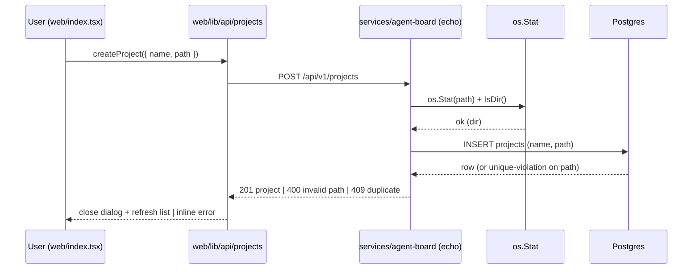

# Architecture — REQ008 Requirement entity + project local-path linking

**Approval:** approved
**Approved-by:** human
**Approved-at:** 2026-06-10T03:58:00Z

## Scope
- **In:**
  - New `Requirement` entity between `Project` and `UserStory` (US044).
  - Re-parent `user_stories` and `documents` under `requirements` (NOT NULL `requirement_id` after a zero-loss backfill) (US044).
  - New NOT NULL, unique `path` column on `projects` (US044).
  - HTTP API (read-only for requirements): list requirements per project, create project with validated path, and **requirement-scoped** listings for user stories and documents (US045).
  - MCP tools: `create_requirement` (po-ba calls at end of Phase 1); `update_requirement` (agents update status/name/description as work progresses); `list_requirements` (agents read project requirements); `create_user_story` and `create_document` updated to require `requirement_id`. Requirement **creation and mutation is MCP-only** — the web is view-only for requirements.
  - FE: "Add Project" form with plain text path input + basename-derived name (US046); requirement-level navigation on the project detail page with the linked path shown read-only (US047).
  - **Full REST hierarchy migration (US048):** every read endpoint for nested resources is moved to its **full canonical entity path** `Project → Requirement → UserStory → Task` (and `Project → Requirement → Document`). This is a **breaking** change — all old flat / shorthand routes are **removed** from `main.go` registration; only the full-hierarchy paths remain. Each nested route validates the full ownership chain (`requirement.project_id == :pid`, `userStory.requirement_id == :rid`, etc.); any mismatch → 404 (no cross-resource information leakage). New canonical paths:
    - `GET /api/v1/projects/:pid/requirements`
    - `GET /api/v1/projects/:pid/requirements/:rid/user-stories`
    - `GET /api/v1/projects/:pid/requirements/:rid/user-stories/:usid`
    - `GET /api/v1/projects/:pid/requirements/:rid/user-stories/:usid/tasks`
    - `GET /api/v1/projects/:pid/requirements/:rid/user-stories/:usid/tasks/:tid`
    - `GET /api/v1/projects/:pid/requirements/:rid/documents`
    - `GET /api/v1/projects/:pid/requirements/:rid/documents/:docid`
  - **`blocked_review_gate` task status (US049):** add `TaskStatusBlockedReviewGate = "blocked_review_gate"` constant to `internal/domain/status_machine.go`. Valid transitions: `in_review → blocked_review_gate` and `changes_requested → blocked_review_gate`. Terminal — no transitions out. No DB migration (status column is TEXT; enforcement is Go-domain-only). Enables agents to set this status via MCP `update_task` when the review gate tool fails (distinct from `blocked_circuit_breaker` which is a code-review failure).
- **Out (explicit non-goals):**
  - Live agent control / file-sync / reading contents of the linked path. Path is stored + validated only.
  - Delete of requirements; editing a project's path after creation. (`update_requirement` status/name/description via MCP **is** in scope — see MCP tools section.)
  - Token tracking, permission UI, agent chat, live activity feed.
  - Any state-machine enforcement on `Requirement.status` — it is a plain stored enum this REQ.
  - Auth: this is a single-user local tool; no auth is introduced (consistent with the existing service, which has none).

## Service topology
| Service | New / Modified | Responsibility | Inter-service calls |
|---|---|---|---|
| `services/agent-board` | modified | The only backend microservice. Owns projects, requirements, user stories, documents, tasks. Adds the `requirements` table, re-parents `user_stories`/`documents`, adds `projects.path`, and exposes the new/modified HTTP + MCP endpoints. | none |

No new microservice. The existing `agent-board` service already owns the entire `Project → UserStory → Task` + `Document` graph; the Requirement level belongs in the same bounded context and the same Go module. Introducing a second service would split a single aggregate across a network boundary for no benefit.

## Frontend surface
| Route (`web/pages/...`) | New / Modified | Owns these user actions | Backend endpoints used |
|---|---|---|---|
| `web/pages/index.tsx` (dashboard) | modified | adds an "Add Project" entry point; renders the new-project form (dialog) | `POST /api/v1/projects` |
| `web/pages/projects/[id].tsx` (project detail) | modified | requirement selection (via `requirement` query param), shows read-only linked path, scopes the US/Documents tabs to the selected requirement | `GET /api/v1/projects/:pid`, `GET /api/v1/projects/:pid/requirements`, `GET /api/v1/projects/:pid/requirements/:rid/user-stories`, `GET /api/v1/projects/:pid/requirements/:rid/documents` |

- **API client layer:** `web/lib/api/` — every backend call lives here; components never call `fetch` directly. One new module: `web/lib/api/requirements.ts`; `web/lib/api/projects.ts` gains `createProject`; `web/lib/api/userStories.ts` and `web/lib/api/documents.ts` gain requirement-scoped fetchers. All new shapes added to `web/lib/api/types.ts`. Mock at this boundary in tests via MSW (`web/test/msw/handlers.ts`).

## Data flow

### Add Project (US046)
Narrative: the user opens the dashboard, clicks "Add Project", types a name and a local path in plain text inputs. The name auto-fills from the path basename (editable). On submit, `createProject` POSTs name + path; the server validates existence/`IsDir` and uniqueness, returns the created project (or 400/409 surfaced inline). On success the dialog closes and the projects list refreshes.



### Requirement navigation (US047)
Narrative: opening `/projects/[id]` fetches the project (now including `path`) and its requirements. The requirements list renders in the header area. The selected requirement is driven by a `requirement` query param (URL is source of truth, mirroring the existing `tab` pattern, `shallow` routing). The User Stories and Documents tabs fetch by the selected `requirementId` rather than `projectId`. Migrated projects show a single "Default" requirement.

```mermaid
sequenceDiagram
    participant U as User (web/projects/[id].tsx)
    participant API as web/lib/api
    participant SVC as services/agent-board
    participant DB as Postgres
    U->>API: fetchProject(pid)
    API->>SVC: GET /api/v1/projects/:pid
    SVC->>DB: SELECT ... path FROM projects
    SVC-->>API: 200 { ..., path }
    U->>API: fetchProjectRequirements(pid)
    API->>SVC: GET /api/v1/projects/:pid/requirements
    SVC->>DB: SELECT ... ORDER BY created_at ASC
    SVC-->>API: 200 { requirements: [...] }
    U->>API: fetchRequirementUserStories(pid, rid)
    API->>SVC: GET /api/v1/projects/:pid/requirements/:rid/user-stories
    SVC->>DB: verify requirement.project_id == pid; SELECT ... WHERE requirement_id=rid
    SVC-->>API: 200 { userStories: [...] } | 404 on chain mismatch
```

## Components
### Backend (`services/agent-board`)
| Package | New / Modified | Responsibility |
|---|---|---|
| `migrations` | modified | New `000003_requirement_entity.up.sql` (+ `.down.sql` for documentation; runner only executes `*.up.sql`). Adds `requirements`, re-parents `user_stories`/`documents`, adds `projects.path`. |
| `internal/domain` | modified | New `Requirement` type; `Project.Path string` (non-pointer, required); `UserStory.RequirementID`, `Document.RequirementID`. |
| `internal/repo` | modified | New `RequirementRepository` (List by project, Create). `ProjectRepo.CreateProject` accepts required `path`; surfaces sentinels `ErrDuplicatePath` (→409) and `ErrInvalidPath` (→400). `UserStoryRepo`/`DocumentRepo` gain `List...ByRequirement`. |
| `internal/handler` | modified | New `RequirementHandler` (list only — no HTTP create). `ProjectHandler` gains `CreateProject` with inline `os.Stat`/`IsDir` path validation; `projectResponse` gains `path`. **US048 — full-hierarchy migration:** all nested-resource read handlers are re-registered under their **full canonical entity paths** and the old flat/shorthand routes are **removed** from `main.go`. `RequirementHandler` lists under `projects/:pid/requirements`. `UserStoryHandler` gains hierarchy list + detail under `projects/:pid/requirements/:rid/user-stories[/:usid]`. `DocumentHandler` gains hierarchy list + detail under `projects/:pid/requirements/:rid/documents[/:docid]`. `TaskHandler` gains hierarchy list + detail under `.../user-stories/:usid/tasks[/:tid]`. Each handler reuses the existing single-resource/list fetch + response mapping and **adds the full ownership-chain validation** (verify `requirement.project_id == :pid`, `userStory.requirement_id == :rid`, `task.user_story_id == :usid`, `document.requirement_id == :rid`); any mismatch (or missing parent) → 404 using the existing not-found envelope — no new handler struct, no new error code. List item shapes gain `requirementId`. |
| `internal/fsutil` (new) | new | `os.Stat`/`IsDir` path validation helper, isolated for unit testing. No suggestion/autocomplete logic. |
| `internal/mcp` / `internal/handler/*_tools.go` | modified | New MCP tools: `create_requirement` (input: `project_id`, `name`, `description`, `status`; returns created requirement object) and `list_requirements` (input: `project_id`; returns requirements array). Called by po-ba at end of Phase 1 to register the REQ DB record. |
| `cmd/api-server/main.go` | modified | Wire the new repos/handlers. **US048:** register the new full-hierarchy routes (`projects/:pid/requirements/...`) and **delete** the old flat/shorthand route registrations (`projects/:id/user-stories`, `projects/:id/documents`, `user-stories/:id`, `user-stories/:id/tasks`, `tasks/:id`, `documents/:id`, and the intermediate `requirements/:rid/...` draft routes). |
| `cmd/mcp-server/main.go` | modified | Register the two new MCP tools. |

### Frontend (`web/`)
| Group | Path | New / Mod | Responsibility |
|---|---|---|---|
| Pages | `web/pages/index.tsx` | mod | host the "Add Project" button + dialog |
| Pages | `web/pages/projects/[id].tsx` | mod | read `requirement` query param; render requirements selector; pass `requirementId` to tabs; show read-only path |
| Components | `web/components/Dashboard/AddProjectDialog.tsx` | new | the add-project form (plain text path input, basename name auto-fill, validation, submit states) |
| Components | `web/components/ProjectDetail/RequirementSelector.tsx` | new | list/select requirements (empty/loading/error states) |
| Components | `web/components/ProjectDetail/ProjectHeader.tsx` | mod | render the read-only linked path (or neutral "no linked path") |
| Components | `web/components/ProjectDetail/UserStoriesTab.tsx`, `DocumentsTab.tsx` (+ their card lists) | mod | accept `requirementId` and fetch by requirement |
| Hooks | `web/hooks/useProjectRequirements.ts` | new | fetch requirements for a project (AbortController/race-safe pattern, mirrors `useProjectUserStories`) |
| Hooks | `web/hooks/useCreateProject.ts` | new | submit state machine (idle/submitting/error) |
| Hooks | `web/hooks/useProjectUserStories.ts`, `useProjectDocuments.ts` | mod | re-key from `projectId` to `requirementId` (new `useRequirementUserStories` / `useRequirementDocuments`, or re-parameterised) |
| API client | `web/lib/api/requirements.ts` | new | typed wrappers for requirement endpoints |
| API client | `web/lib/api/projects.ts` | mod | add `createProject` |
| API client | `web/lib/api/userStories.ts`, `documents.ts` | mod | add requirement-scoped fetchers |
| Types | `web/lib/api/types.ts` | mod | `Requirement`, `RequirementsResponse`, `CreateProjectRequest`, `Project.path`, `requirementId` on list items |
| MSW | `web/test/msw/handlers.ts` | mod | handlers for all new/modified endpoints reflecting the exact JSON below |

## Infrastructure
- **Databases:** existing single Postgres instance owned by `agent-board` (via `DATABASE_URL`). No new database. Schema changes via embedded migration `000003`.
- **Caches / queues:** none.
- **External services:** none. The filesystem is read via the Go standard library (`os`) on the host running `agent-board`.
- **Env vars added:** none required. FE continues to use existing `NEXT_PUBLIC_API_BASE_URL`. (Optional hardening env `FS_SUGGESTIONS_ROOT` is proposed under Open questions but **not** adopted this REQ.)
- **CORS:** unchanged — `main.go` already configures `middleware.CORSWithConfig` from `FRONTEND_URL`. The new routes are under the same echo instance and inherit it.
- **Deployment surface change:** none structural. Note operational consequence (D-005): the `fs/suggestions` endpoint and path validation read the **local filesystem of the api-server process/container**, so suggested/linked paths are server-side paths, not the browser user's paths. Documented as a known constraint of this local-tool REQ.

## API contracts (exact)

Conventions (match existing service):
- Base prefix `/api/v1`. All bodies are JSON; request `Content-Type: application/json`.
- **Error envelope (shared, existing):** `{ "code": "string", "message": "string" }`. Validation errors use code `VALIDATION_ERROR`; not-found `NOT_FOUND`; duplicate path `DUPLICATE_PATH`; internal `INTERNAL_ERROR`.
- Timestamps are ISO-8601 UTC strings formatted `2006-01-02T15:04:05Z` (existing convention).
- List endpoints wrap arrays in a named key and are **never** `null` (always `[]`).
- No auth headers (single-user local tool).

> **Path resolution note (D-002):** All HTTP endpoints use the `/api/v1` prefix, consistent with every existing route. The original US045 prose used bare paths like `/api/requirements` — those are superseded by the locked contracts below.

> **Full-hierarchy decision (D-009, US048):** Every nested-resource read endpoint follows the **full canonical entity hierarchy** `Project → Requirement → UserStory → Task` (and `Project → Requirement → Document`). There are **no shorthand / flat paths** — all of them are **removed** from route registration. Each nested route validates the complete ownership chain and returns **404** on any link mismatch.

### Endpoint summary — canonical (kept)

| # | Method | Path | New / Modified | Notes |
|---|---|---|---|---|
| 1 | GET | `/api/v1/projects` | modified | adds `path` field to each item |
| 2 | GET | `/api/v1/projects/:pid` | modified | adds `path` field |
| 3 | POST | `/api/v1/projects` | new | create project with required validated `path` |
| 4 | GET | `/api/v1/projects/:pid/requirements` | new | list requirements for a project |
| 5 | GET | `/api/v1/projects/:pid/requirements/:rid/user-stories` | new (replaces flat) | requirement-scoped story list; chain: `requirement.project_id == :pid` |
| 6 | GET | `/api/v1/projects/:pid/requirements/:rid/user-stories/:usid` | new (replaces flat) | story detail; chain: `req.project_id==:pid`, `us.requirement_id==:rid` |
| 7 | GET | `/api/v1/projects/:pid/requirements/:rid/user-stories/:usid/tasks` | new (replaces flat) | task list for a story; full chain validated |
| 8 | GET | `/api/v1/projects/:pid/requirements/:rid/user-stories/:usid/tasks/:tid` | new (replaces flat) | task detail; full chain validated incl. `task.user_story_id==:usid` |
| 9 | GET | `/api/v1/projects/:pid/requirements/:rid/documents` | new (replaces flat) | requirement-scoped document list; chain: `requirement.project_id==:pid` |
| 10 | GET | `/api/v1/projects/:pid/requirements/:rid/documents/:docid` | new (replaces flat) | document detail (incl. `content`); chain: `req.project_id==:pid`, `doc.requirement_id==:rid` |
| 11 | MCP | `create_requirement` / `list_requirements` / `update_requirement` | new | agent-only; no HTTP create/update endpoint |
| 12 | MCP | `create_user_story` | **BREAKING — modified** | input gains required `requirement_id`; INSERT must populate it or it fails NOT NULL |
| 13 | MCP | `create_document` | **BREAKING — modified** | input gains required `requirement_id`; INSERT must populate it or it fails NOT NULL |
| — | — | `PATCH/PUT /api/v1/requirements/:id` | **out of scope (HTTP)** | requirement update is **MCP-only** via `update_requirement`; no HTTP PATCH this REQ (see D-007) |

### Endpoint summary — REMOVED (breaking; deleted from `main.go`)

| Method | Old path | Replaced by |
|---|---|---|
| GET | `/api/v1/projects/:id/user-stories` | #5 `projects/:pid/requirements/:rid/user-stories` |
| GET | `/api/v1/projects/:id/documents` | #9 `projects/:pid/requirements/:rid/documents` |
| GET | `/api/v1/user-stories/:id` | #6 `.../user-stories/:usid` |
| GET | `/api/v1/user-stories/:id/tasks` | #7 `.../user-stories/:usid/tasks` |
| GET | `/api/v1/tasks/:id` | #8 `.../tasks/:tid` |
| GET | `/api/v1/documents/:id` | #10 `.../documents/:docid` |
| GET | `/api/v1/requirements/:rid/user-stories` | #5 (intermediate draft route, removed) |
| GET | `/api/v1/requirements/:rid/documents` | #9 (intermediate draft route, removed) |

> **No backward compatibility for these routes.** All callers (FE, e2e, any MCP HTTP usage) must migrate to the canonical hierarchy paths. MCP **tools** are unaffected — they call repositories directly and do not use URL paths.

---

---

### 1. GET /api/v1/projects — list projects (MODIFIED: now includes `path`)
- **Service:** `services/agent-board`
- **Auth:** none
- **Request body:** none
- **Responses:**
  - **200 OK** — each project object **gains a `path` field** (`string`):
    ```json
    {
      "projects": [
        {
          "id": "11111111-1111-1111-1111-111111111111",
          "name": "agents-board",
          "description": "",
          "path": "/Users/me/workspace/agents-board",
          "createdAt": "2026-06-01T09:00:00Z",
          "updatedAt": "2026-06-01T09:00:00Z"
        }
      ]
    }
    ```
    `path` is `string` — always a non-empty directory path. **The key is always present.**
  - **500**: `{ "code": "INTERNAL_ERROR", "message": "Failed to fetch projects" }`

### 2. GET /api/v1/projects/:pid — get one project (MODIFIED: now includes `path`)
- **Service:** `services/agent-board`
- **Auth:** none
- **Path params:** `pid` — project UUID
- **200 OK** — bare project object (existing shape) **plus `path`**:
  ```json
  {
    "id": "11111111-1111-1111-1111-111111111111",
    "name": "agents-board",
    "description": "",
    "path": "/Users/me/workspace/agents-board",
    "createdAt": "2026-06-01T09:00:00Z",
    "updatedAt": "2026-06-01T09:00:00Z"
  }
  ```
- **404**: `{ "code": "NOT_FOUND", "message": "Project not found" }`
- **500**: `{ "code": "INTERNAL_ERROR", "message": "Failed to fetch project" }`

### 3. POST /api/v1/projects — create a project with a validated path (NEW HTTP handler)
- **Service:** `services/agent-board`
- **Auth:** none
- **Request body:**
  ```json
  {
    "name": "agents-board",
    "description": "",
    "path": "/Users/me/workspace/agents-board"
  }
  ```
  Field rules: `name` string **required, non-blank** (trimmed); `description` string **optional** (default `""`); `path` string **required, non-blank** — must exist on disk (`os.Stat`) and be a directory (`IsDir()`), and must be unique across projects.
- **Responses:**
  - **201 Created** — bare project object including `path`:
    ```json
    {
      "id": "33333333-3333-3333-3333-333333333333",
      "name": "agents-board",
      "description": "",
      "path": "/Users/me/workspace/agents-board",
      "createdAt": "2026-06-09T11:00:00Z",
      "updatedAt": "2026-06-09T11:00:00Z"
    }
    ```
  - **400 Bad Request** — blank/absent `name` or `path`, OR `path` does not exist / is not a directory (persists nothing):
    ```json
    { "code": "VALIDATION_ERROR", "message": "path is required" }
    { "code": "VALIDATION_ERROR", "message": "path does not exist or is not a directory" }
    { "code": "VALIDATION_ERROR", "message": "name is required" }
    ```
  - **409 Conflict** — `path` already linked to another project (persists nothing):
    ```json
    { "code": "DUPLICATE_PATH", "message": "path already linked to another project" }
    ```
  - **500 Internal Server Error**: `{ "code": "INTERNAL_ERROR", "message": "Failed to create project" }`
- **Idempotency:** none. Uniqueness on `path` is enforced at the DB level and surfaced as 409. The FE distinguishes 400 (code `VALIDATION_ERROR`) vs 409 (code `DUPLICATE_PATH`) to render the right inline message.

### 4. GET /api/v1/projects/:pid/requirements — list requirements for a project
- **Service:** `services/agent-board`
- **Auth:** none
- **Path params:** `pid` — project UUID
- **Query params:** none
- **Request body:** none
- **Responses:**
  - **200 OK** — ordered by `createdAt` ASC (deterministic):
    ```json
    {
      "requirements": [
        {
          "id": "b2e9d0c1-2f3a-4b5c-8d7e-1a2b3c4d5e6f",
          "projectId": "11111111-1111-1111-1111-111111111111",
          "name": "Default",
          "description": "",
          "status": "draft",
          "createdAt": "2026-06-09T10:00:00Z",
          "updatedAt": "2026-06-09T10:00:00Z"
        }
      ]
    }
    ```
    Field types: `id` string(uuid); `projectId` string(uuid); `name` string(non-empty); `description` string (MAY be ""); `status` enum `"draft"|"in_progress"|"done"`; `createdAt`/`updatedAt` string(ISO-8601 UTC). Empty project → `{ "requirements": [] }`.
  - **404 Not Found** — project does not exist: `{ "code": "NOT_FOUND", "message": "Project not found" }`
  - **500 Internal Server Error**: `{ "code": "INTERNAL_ERROR", "message": "Failed to fetch requirements" }`

### 5. MCP tools — `create_requirement`, `list_requirements`, `update_requirement`
Requirement creation is **MCP-only**. po-ba calls `create_requirement` at the end of Phase 1 to register the REQ DB record after writing the docs to disk.

**`create_requirement`**
- **Input:** `project_id` (string, uuid, required), `name` (string, required non-blank), `description` (string, optional, default `""`), `status` (string, optional, one of `"draft"|"in_progress"|"done"`, default `"draft"`)
- **Output (success):** the created requirement object (same shape as the list item)
- **Errors:** project not found → tool error; blank name → tool error; invalid status → tool error

**`list_requirements`**
- **Input:** `project_id` (string, uuid, required)
- **Output (success):** `{ "requirements": [...] }` — same shape as `GET /api/v1/projects/:pid/requirements`
- **Errors:** project not found → tool error

**`update_requirement`** (NEW — Revision 4)
- **Why:** agents (po-ba, tech-lead-planner, tester, be-dev, fe-dev) advance a requirement's lifecycle as work progresses (e.g. `draft → in_progress → done`). Without this tool there is no way to mutate `Requirement.status` after creation. Mirrors the existing `update_user_story` / `update_document` / `update_project` MCP tools (partial update via pointer fields).
- **Input:** `requirement_id` (string, uuid, **required**); `status` (string, optional, one of `"draft"|"in_progress"|"done"`); `name` (string, optional, non-blank if provided); `description` (string, optional). At least one mutable field SHOULD be provided; an all-empty update is a no-op returning the current object.
- **Behaviour:** partial update — only provided fields change. `status` is validated against the enum (`draft|in_progress|done`); invalid value → tool error. **No state-machine enforcement** (consistent with Scope: `Requirement.status` is a plain stored enum this REQ — any of the three values may be set from any other). `name`, if provided, is trimmed and must be non-blank. `updated_at` is bumped on any change.
- **Output (success):** the updated requirement object (same shape as the list item):
  ```json
  {
    "id": "b2e9d0c1-2f3a-4b5c-8d7e-1a2b3c4d5e6f",
    "projectId": "11111111-1111-1111-1111-111111111111",
    "name": "Default",
    "description": "",
    "status": "in_progress",
    "createdAt": "2026-06-09T10:00:00Z",
    "updatedAt": "2026-06-09T12:30:00Z"
  }
  ```
- **Errors:** requirement not found → tool error; invalid status value → tool error; blank `name` when provided → tool error.

**HTTP PATCH decision (D-007):** No HTTP `PATCH /api/v1/requirements/:id` this REQ. Requirement mutation is **MCP-only**, consistent with create being MCP-only (D-004): the web surface is view-only for requirements; only agents change requirement status. Adding an HTTP PATCH would be unused surface. Deferred to a future REQ if/when the web gains requirement-editing UI.

The four read/write requirement tools (`create_requirement`, `list_requirements`, `update_requirement`) and the HTTP list handler all share the single underlying `RequirementRepository` — no separate code path.

### 6. GET /api/v1/projects/:pid/requirements/:rid/user-stories — list user stories scoped to a requirement
- **Service:** `services/agent-board`
- **Auth:** none
- **Path params:** `pid` — project UUID; `rid` — requirement UUID
- **Ownership chain:** verify the requirement exists and `requirement.project_id == :pid`; on any mismatch (requirement not found, or belongs to a different project, or project does not exist) → **404** (`NOT_FOUND`), indistinguishable to the caller (no cross-project leakage).
- **Responses:**
  - **200 OK** — item shape includes `requirementId`:
    ```json
    {
      "userStories": [
        {
          "id": "aaaaaaaa-aaaa-aaaa-aaaa-aaaaaaaaaaaa",
          "projectId": "11111111-1111-1111-1111-111111111111",
          "requirementId": "b2e9d0c1-2f3a-4b5c-8d7e-1a2b3c4d5e6f",
          "title": "Add item to basket",
          "description": "",
          "status": "in_progress",
          "taskCount": 3,
          "createdAt": "2026-06-02T09:00:00Z",
          "updatedAt": "2026-06-02T09:00:00Z"
        }
      ]
    }
    ```
    Order: `createdAt` DESC (existing convention). `requirementId` is `string(uuid)`, **always present**. Empty → `{ "userStories": [] }`.
  - **404 Not Found** — chain mismatch: `{ "code": "NOT_FOUND", "message": "Requirement not found" }`
  - **500**: `{ "code": "INTERNAL_ERROR", "message": "Failed to fetch user stories" }`

### 7. GET /api/v1/projects/:pid/requirements/:rid/user-stories/:usid — user story detail
- **Service:** `services/agent-board` (existing `UserStoryHandler.GetUserStory` fetch + response mapping, under the hierarchy route + chain guard)
- **Auth:** none
- **Path params:** `pid` — project UUID; `rid` — requirement UUID; `usid` — user story UUID
- **Ownership chain:** fetch the user story by `usid`; verify `userStory.requirement_id == :rid` **and** `userStory.project_id == :pid` (equivalently, requirement exists, `requirement.project_id == :pid`, and the story belongs to that requirement). Any mismatch or not-found → **404**, indistinguishable.
- **Responses:**
  - **200 OK** — bare user story detail object (no `taskCount`):
    ```json
    {
      "id": "aaaaaaaa-aaaa-aaaa-aaaa-aaaaaaaaaaaa",
      "projectId": "11111111-1111-1111-1111-111111111111",
      "requirementId": "b2e9d0c1-2f3a-4b5c-8d7e-1a2b3c4d5e6f",
      "title": "Add item to basket",
      "description": "",
      "status": "in_progress",
      "createdAt": "2026-06-02T09:00:00Z",
      "updatedAt": "2026-06-02T09:00:00Z"
    }
    ```
  - **404 Not Found** — chain mismatch / not found: `{ "code": "NOT_FOUND", "message": "User story not found" }`
  - **500**: `{ "code": "INTERNAL_ERROR", "message": "Internal server error" }`

### 8. GET /api/v1/projects/:pid/requirements/:rid/user-stories/:usid/tasks — task list for a story
- **Service:** `services/agent-board` (existing task-list fetch + response mapping, under the hierarchy route + full chain guard)
- **Auth:** none
- **Path params:** `pid`, `rid`, `usid` — project / requirement / user story UUIDs
- **Ownership chain:** verify `requirement.project_id == :pid`, `userStory.requirement_id == :rid`, `userStory.project_id == :pid` before returning tasks. Any mismatch / not-found → **404**.
- **Responses:**
  - **200 OK** — task list (existing task item shape, unchanged by this REQ; tasks key off `user_story_id`). Array never `null`:
    ```json
    {
      "tasks": [
        {
          "id": "dddddddd-dddd-dddd-dddd-dddddddddddd",
          "userStoryId": "aaaaaaaa-aaaa-aaaa-aaaa-aaaaaaaaaaaa",
          "title": "be_basket_repo",
          "description": "",
          "status": "pending",
          "track": "BE",
          "createdAt": "2026-06-02T09:00:00Z",
          "updatedAt": "2026-06-02T09:00:00Z"
        }
      ]
    }
    ```
    Field shape mirrors the existing task list response exactly (only the URL changes). Empty → `{ "tasks": [] }`.
  - **404 Not Found** — chain mismatch / not found: `{ "code": "NOT_FOUND", "message": "User story not found" }`
  - **500**: `{ "code": "INTERNAL_ERROR", "message": "Failed to fetch tasks" }`

### 9. GET /api/v1/projects/:pid/requirements/:rid/user-stories/:usid/tasks/:tid — task detail
- **Service:** `services/agent-board` (existing `GetTask` fetch + response mapping, under the hierarchy route + full chain guard)
- **Auth:** none
- **Path params:** `pid`, `rid`, `usid`, `tid` — project / requirement / user story / task UUIDs
- **Ownership chain:** verify `requirement.project_id == :pid`, `userStory.requirement_id == :rid`, `userStory.project_id == :pid`, **and** `task.user_story_id == :usid`. Any mismatch / not-found → **404**, indistinguishable.
- **Responses:**
  - **200 OK** — bare task detail object (existing task detail shape, unchanged by this REQ):
    ```json
    {
      "id": "dddddddd-dddd-dddd-dddd-dddddddddddd",
      "userStoryId": "aaaaaaaa-aaaa-aaaa-aaaa-aaaaaaaaaaaa",
      "title": "be_basket_repo",
      "description": "",
      "status": "pending",
      "track": "BE",
      "createdAt": "2026-06-02T09:00:00Z",
      "updatedAt": "2026-06-02T09:00:00Z"
    }
    ```
    Body is identical to the existing task detail response (only the URL changes).
  - **404 Not Found** — chain mismatch / not found: `{ "code": "NOT_FOUND", "message": "Task not found" }`
  - **500**: `{ "code": "INTERNAL_ERROR", "message": "Internal server error" }`

### 10. GET /api/v1/projects/:pid/requirements/:rid/documents — list documents scoped to a requirement
- **Service:** `services/agent-board`
- **Auth:** none
- **Path params:** `pid` — project UUID; `rid` — requirement UUID
- **Ownership chain:** verify `requirement.project_id == :pid`; any mismatch / not-found → **404**.
- **Responses:**
  - **200 OK** — metadata-only item shape (no `content`), includes `requirementId`:
    ```json
    {
      "documents": [
        {
          "id": "cccccccc-cccc-cccc-cccc-cccccccccccc",
          "projectId": "11111111-1111-1111-1111-111111111111",
          "requirementId": "b2e9d0c1-2f3a-4b5c-8d7e-1a2b3c4d5e6f",
          "title": "README",
          "createdAt": "2026-06-02T09:00:00Z",
          "updatedAt": "2026-06-02T09:00:00Z"
        }
      ]
    }
    ```
    `requirementId` is `string(uuid)`, **always present**. Empty → `{ "documents": [] }`.
  - **404 Not Found** — chain mismatch: `{ "code": "NOT_FOUND", "message": "Requirement not found" }`
  - **500**: `{ "code": "INTERNAL_ERROR", "message": "Failed to fetch documents" }`

### 11. GET /api/v1/projects/:pid/requirements/:rid/documents/:docid — document detail
- **Service:** `services/agent-board` (existing `DocumentHandler.GetDocument` fetch + response mapping, under the hierarchy route + chain guard)
- **Auth:** none
- **Path params:** `pid` — project UUID; `rid` — requirement UUID; `docid` — document UUID
- **Ownership chain:** fetch the document by `docid`; verify `document.requirement_id == :rid` **and** `document.project_id == :pid` (equivalently, requirement exists, `requirement.project_id == :pid`, and the document belongs to that requirement). Any mismatch / not-found → **404**, indistinguishable.
- **Responses:**
  - **200 OK** — full document object **including `content`** and `requirementId`:
    ```json
    {
      "id": "cccccccc-cccc-cccc-cccc-cccccccccccc",
      "projectId": "11111111-1111-1111-1111-111111111111",
      "requirementId": "b2e9d0c1-2f3a-4b5c-8d7e-1a2b3c4d5e6f",
      "title": "README",
      "content": "# README\n...",
      "createdAt": "2026-06-02T09:00:00Z",
      "updatedAt": "2026-06-02T09:00:00Z"
    }
    ```
  - **404 Not Found** — chain mismatch / not found: `{ "code": "NOT_FOUND", "message": "Document not found" }`
  - **500**: `{ "code": "INTERNAL_ERROR", "message": "Failed to fetch document" }`

### 12. MCP `create_user_story` — **BREAKING CHANGE: must supply `requirement_id`**
- **Service:** `services/agent-board` (existing `RegisterUserStoryTools` → `create_user_story`)
- **Why this breaks:** the current INSERT is `INSERT INTO user_stories (project_id, title, description, status)` (`user_story_repo.go:47`). After migration `000003` sets `user_stories.requirement_id NOT NULL`, **every existing `create_user_story` call fails** with a NOT NULL violation. There is **no HTTP create-story endpoint** — story creation is MCP-only — so this MCP tool is the sole write path and must be fixed.
- **Input (modified):** `project_id` (string, uuid, required); `requirement_id` (string, uuid, **required — NEW**); `title` (string, required); `description` (string, optional); `status` (string, optional, default `"draft"`).
- **Validation:** `requirement_id` required and non-blank; SHOULD belong to `project_id` (the requirement's `project_id` must equal the supplied `project_id`) — mismatch → tool error `requirement does not belong to project`. Repo INSERT becomes `INSERT INTO user_stories (project_id, requirement_id, title, description, status)`.
- **Output (success):** the created story object, now including `requirementId`:
  ```json
  {
    "id": "aaaaaaaa-aaaa-aaaa-aaaa-aaaaaaaaaaaa",
    "projectId": "11111111-1111-1111-1111-111111111111",
    "requirementId": "b2e9d0c1-2f3a-4b5c-8d7e-1a2b3c4d5e6f",
    "title": "Add item to basket",
    "description": "",
    "status": "draft",
    "createdAt": "2026-06-09T12:00:00Z",
    "updatedAt": "2026-06-09T12:00:00Z"
  }
  ```
- **Errors:** missing `project_id`/`requirement_id`/`title` → tool error; requirement not found or not in project → tool error; invalid initial status → tool error (existing rule retained).

### 13. MCP `create_document` — **BREAKING CHANGE: must supply `requirement_id`**
- **Service:** `services/agent-board` (existing `RegisterDocumentTools` → `create_document`)
- **Why this breaks:** the current INSERT is `INSERT INTO documents (project_id, title, content)` (`document_repo.go:31`). After migration `000003` sets `documents.requirement_id NOT NULL`, **every existing `create_document` call fails**. There is **no HTTP create-document endpoint** — document creation is MCP-only — so this tool must be fixed.
- **Input (modified):** `project_id` (string, uuid, required); `requirement_id` (string, uuid, **required — NEW**); `title` (string, required); `content` (string, optional).
- **Validation:** `requirement_id` required and non-blank; SHOULD belong to `project_id` (mismatch → tool error). Repo INSERT becomes `INSERT INTO documents (project_id, requirement_id, title, content)`.
- **Output (success):** the created document object, now including `requirementId`:
  ```json
  {
    "id": "cccccccc-cccc-cccc-cccc-cccccccccccc",
    "projectId": "11111111-1111-1111-1111-111111111111",
    "requirementId": "b2e9d0c1-2f3a-4b5c-8d7e-1a2b3c4d5e6f",
    "title": "README",
    "content": "# README\n...",
    "createdAt": "2026-06-09T12:00:00Z",
    "updatedAt": "2026-06-09T12:00:00Z"
  }
  ```
- **Errors:** missing `project_id`/`requirement_id`/`title` → tool error; requirement not found or not in project → tool error.

> **Note on other MCP write tools:** `update_user_story`, `update_document`, `update_project`, and all status-transition / delete tools do **not** change parents and do **not** touch `requirement_id` — their UPDATE/DELETE statements are unaffected by the NOT NULL column. The MCP `create_project` tool (which only sets `name`/`description`) is addressed under Breaking changes below (`projects.path` NOT NULL).

---

## Data model

Migration `000003_requirement_entity.up.sql` (single file, runs in one transaction per the migration runner; a documentation-only `.down.sql` is provided but **not** auto-executed since the runner embeds only `*.up.sql`).

```sql
-- 1. requirements table
CREATE TABLE requirements (
    id          UUID PRIMARY KEY DEFAULT gen_random_uuid(),
    project_id  UUID NOT NULL REFERENCES projects(id) ON DELETE CASCADE,
    name        VARCHAR(255) NOT NULL,
    description TEXT NOT NULL DEFAULT '',
    status      VARCHAR(50) NOT NULL DEFAULT 'draft'
                CHECK (status IN ('draft', 'in_progress', 'done')),
    created_at  TIMESTAMPTZ NOT NULL DEFAULT NOW(),
    updated_at  TIMESTAMPTZ NOT NULL DEFAULT NOW()
);
CREATE INDEX idx_requirements_project_id ON requirements(project_id);

-- 2. projects.path — NOT NULL, unique
ALTER TABLE projects ADD COLUMN path TEXT NOT NULL DEFAULT '';
ALTER TABLE projects ADD CONSTRAINT uq_projects_path UNIQUE (path);
-- Note: DEFAULT '' exists only to satisfy NOT NULL during the ALTER on existing rows;
-- the application layer always requires a non-blank path, so the empty-string default
-- is never reachable via the API. Remove DEFAULT after backfill if desired.

-- 3. re-parent columns, added NULLABLE first so the backfill can populate them
ALTER TABLE user_stories ADD COLUMN requirement_id UUID
    REFERENCES requirements(id) ON DELETE CASCADE;
ALTER TABLE documents ADD COLUMN requirement_id UUID
    REFERENCES requirements(id) ON DELETE CASCADE;

-- 4. BACKFILL (zero data loss, D-2): one "Default" requirement per EXISTING project,
--    then re-parent that project's user_stories and documents under it.
INSERT INTO requirements (project_id, name, status)
SELECT id, 'Default', 'draft' FROM projects;

UPDATE user_stories us
SET requirement_id = r.id
FROM requirements r
WHERE r.project_id = us.project_id AND r.name = 'Default';

UPDATE documents d
SET requirement_id = r.id
FROM requirements r
WHERE r.project_id = d.project_id AND r.name = 'Default';

-- 5. enforce NOT NULL only AFTER backfill (no orphans by construction —
--    every project got a Default requirement; every child shares the project_id)
ALTER TABLE user_stories ALTER COLUMN requirement_id SET NOT NULL;
ALTER TABLE documents    ALTER COLUMN requirement_id SET NOT NULL;

CREATE INDEX idx_user_stories_requirement_id ON user_stories(requirement_id);
CREATE INDEX idx_documents_requirement_id    ON documents(requirement_id);
```

Notes:
- `project_id` is **kept** on `user_stories` and `documents` (denormalised parent) so the retained project-scoped list endpoints keep working without a join, and so the backfill is a simple equi-update. `requirement_id` is the authoritative new parent.
- The backfill creates a Default requirement for **every** project (including those with no children) — this is harmless and gives US047 a non-empty requirements list for every existing project. AC for "Empty requirements" empty state is still exercisable via a freshly created project that has no requirements (creation does not auto-add one).
- `description NOT NULL DEFAULT ''` mirrors how the existing handlers treat empty strings rather than nulls.
- `projects.path` is NOT NULL + UNIQUE — every project must link to a distinct local directory.
- **Down path (documentation only):** drop the two indexes + `requirement_id` columns, drop `uq_projects_path` + `projects.path`, drop `requirements`. Dropping `requirements` cascades to nothing destructive on `user_stories`/`documents` because their `requirement_id` columns are removed first; the original `Default` grouping is lost (acceptable, documented data-loss on down).

### Breaking changes & migration notes

This REQ has **two independent classes of breaking change**: (A) the NOT NULL migration on the write/INSERT paths, and (B) the **full-hierarchy route migration (US048)** which **removes** all flat/shorthand read routes.

**(B) REMOVED HTTP routes (US048 — breaking for all HTTP callers; MCP tools unaffected).** These route registrations are **deleted** from `cmd/api-server/main.go`. Any FE code, e2e test, or HTTP caller hitting them gets a 404 (no route) and must migrate to the canonical hierarchy path:

| Removed route | Replacement (canonical hierarchy) |
|---|---|
| `GET /api/v1/projects/:id/user-stories` | `GET /api/v1/projects/:pid/requirements/:rid/user-stories` (§6) |
| `GET /api/v1/projects/:id/documents` | `GET /api/v1/projects/:pid/requirements/:rid/documents` (§10) |
| `GET /api/v1/user-stories/:id` | `GET /api/v1/projects/:pid/requirements/:rid/user-stories/:usid` (§7) |
| `GET /api/v1/user-stories/:id/tasks` | `GET /api/v1/projects/:pid/requirements/:rid/user-stories/:usid/tasks` (§8) |
| `GET /api/v1/tasks/:id` | `GET /api/v1/projects/:pid/requirements/:rid/user-stories/:usid/tasks/:tid` (§9) |
| `GET /api/v1/documents/:id` | `GET /api/v1/projects/:pid/requirements/:rid/documents/:docid` (§11) |
| `GET /api/v1/requirements/:rid/user-stories` (intermediate draft route) | §6 |
| `GET /api/v1/requirements/:rid/documents` (intermediate draft route) | §10 |

The underlying handler fetch + response-mapping logic is **reused** — only the route registration and the added ownership-chain guards change. The FE API client (`web/lib/api/*`) and all e2e specs must be migrated to the new paths in the same release. **MCP tools are not affected** — they invoke repositories directly and never construct URL paths.

**(A) NOT NULL migration on write paths.** Migration `000003` makes three columns mandatory (`user_stories.requirement_id`, `documents.requirement_id`, `projects.path` — all NOT NULL). Every code path that **INSERTs** into those tables breaks until updated. The audit below was produced by inspecting the live service code; the central finding: **there is NO HTTP create endpoint for user stories or documents — all creation is MCP-only — so the INSERT breaks are in the MCP create tools and their repo INSERTs, not in HTTP handlers.**

| Write path | File / line | Break | Fix |
|---|---|---|---|
| MCP `create_user_story` repo INSERT | `internal/repo/user_story_repo.go:47` | `INSERT INTO user_stories (project_id, title, description, status)` omits `requirement_id` → NOT NULL violation on every create | Add `requirement_id` to INSERT column list + bind param; tool input gains required `requirement_id` (contract §12) |
| MCP `create_document` repo INSERT | `internal/repo/document_repo.go:31` | `INSERT INTO documents (project_id, title, content)` omits `requirement_id` → NOT NULL violation on every create | Add `requirement_id` to INSERT + bind; tool input gains required `requirement_id` (contract §13) |
| MCP `create_project` repo INSERT | `ProjectRepo.CreateProject` (`internal/repo/project_repo.go`) + MCP tool `project_tools.go:23` | `create_project` MCP tool sets only `name`/`description` (no `path`); INSERT omits `path` → NOT NULL violation (DB DEFAULT `''` saves it from erroring, but `''` then collides with `uq_projects_path` on the **second** path-less create → 23505) | Decision needed (D-008 below): make `create_project` MCP tool require `path`, OR keep the DB `DEFAULT ''` only for the single legacy row and route all human creation through the new `POST /api/v1/projects` (§4). Recommended: MCP `create_project` also requires a non-blank, validated, unique `path`. |
| Domain structs | `domain/user_story.go`, `domain/document.go`, `domain/project.go` | structs lack `RequirementID` / `Path` fields | Add `RequirementID string json:"requirementId"` to `UserStory` + `Document`; add `Path string json:"path"` to `Project` (already noted in Components) |
| Repo SELECTs (reads) | `GetUserStory`, `ListUserStoriesWithTaskCount`, `GetDocument`, `ListDocuments`, `GetProject`, `ListProjects` | SELECT column lists + `Scan` targets must include the new columns to populate the new response fields | Add `requirement_id` / `path` to each SELECT and `Scan(...)`. **Non-breaking** but required for the new response fields to be non-empty. |

**Response shape changes (path additive on projects; `requirementId` additive on nested items). Note the URL itself is breaking for nested resources — see (B) above.**

| Endpoint (canonical) | Field added vs. pre-REQ | URL changed? |
|---|---|---|
| `GET /api/v1/projects` (§1) | `path` (string) on each project | No — same path, additive field |
| `GET /api/v1/projects/:pid` (§2) | `path` (string) | No — same path, additive field |
| `GET .../requirements/:rid/user-stories` (§6) | `requirementId` (string,uuid) per item | **Yes** — replaces `projects/:id/user-stories` |
| `GET .../requirements/:rid/user-stories/:usid` (§7) | `requirementId` (string,uuid) | **Yes** — replaces `user-stories/:id` |
| `GET .../user-stories/:usid/tasks` (§8) | none (task shape unchanged) | **Yes** — replaces `user-stories/:id/tasks` |
| `GET .../user-stories/:usid/tasks/:tid` (§9) | none (task shape unchanged) | **Yes** — replaces `tasks/:id` |
| `GET .../requirements/:rid/documents` (§10) | `requirementId` (string,uuid) per item | **Yes** — replaces `projects/:id/documents` |
| `GET .../requirements/:rid/documents/:docid` (§11) | `requirementId` (string,uuid) | **Yes** — replaces `documents/:id` |

**Migration ordering safety:** the backfill (step 4) runs while `requirement_id` is still NULLABLE and BEFORE the `SET NOT NULL` (step 5), so existing rows are populated with their project's `Default` requirement first. No application deploy can race the migration into an INSERT against the not-yet-backfilled table because the whole migration runs in one transaction. **However**, the application code (repo INSERTs §12/§13, `create_project` path handling, and the US048 route re-registration) MUST ship in the **same release** as migration `000003` — deploying the migration against the *old* binary would immediately break MCP story/document/project creation, and the FE/e2e must move to the new hierarchy paths atomically with the route deletion. Call this out to the planner so the BE route changes and the FE client migration are coordinated in one release.

## Key decisions (ADR-lite)

### D-001 — Keep everything in the single `agent-board` service
- **Context:** REQ adds a level to an existing aggregate already wholly owned by `agent-board`.
- **Decision:** Extend `agent-board`; no new microservice.
- **Alternatives rejected:** A `requirements` service — would split one aggregate across a network call, force distributed transactions for the backfill, and add deployment surface for zero benefit.
- **Consequences:** All new tables/endpoints land in one module; simplest migration and testing.

### D-002 — `/api/v1` prefix for every new HTTP endpoint
- **Context:** README/US045 prose shows bare `/api/...`; existing routes are all `/api/v1/...`.
- **Decision:** Lock `/api/v1` for all REQ008 HTTP endpoints.
- **Alternatives rejected:** Un-versioned namespace — inconsistent and harder for the FE client (which derives base URL once).
- **Consequences:** All new HTTP routes and MSW handlers bind to `/api/v1/...`.

### D-003 — Re-parent keeps `project_id` alongside new `requirement_id`
- **Context:** Stories/documents must move under requirements (NOT NULL), but existing project-scoped endpoints and the backfill rely on `project_id`.
- **Decision:** Add `requirement_id` (NOT NULL after backfill) **and retain** `project_id`.
- **Alternatives rejected:** Drop `project_id` and always join through `requirements` — breaks current callers and complicates the backfill with no payoff for this REQ.
- **Consequences:** Mild denormalisation (a story's `project_id` must stay consistent with its requirement's project — acceptable; no write path in this REQ changes parents).

### D-004 — Requirement create via MCP only; HTTP API is read-only for requirements
- **Context:** Requirements are created by po-ba (agent) at end of Phase 1, not by humans via the web form.
- **Decision:** No `POST /api/v1/projects/:id/requirements` HTTP endpoint. Create and list via MCP tools (`create_requirement`, `list_requirements`). Web reads via `GET /api/v1/projects/:id/requirements`.
- **Alternatives rejected:** HTTP create endpoint — unnecessary surface; human doesn't create REQ records directly.
- **Consequences:** po-ba must call the MCP tool after writing REQ docs to disk. Web is view-only for requirements.

### D-005 — No filesystem autocomplete; plain text path input
- **Context:** Autocomplete requires a `fs/suggestions` endpoint (server-side filesystem exposure) and a debounced dropdown component — complexity the user explicitly rejected.
- **Decision:** Remove autocomplete entirely. Path input is a plain `<input type="text">`. User types the full path manually; name auto-fills from basename.
- **Alternatives rejected:** Autocomplete (complex, exposes server filesystem layout).
- **Consequences:** Simpler FE, no `FSHandler`, no `fsutil` suggestion logic, no `web/lib/api/fs.ts`. Path validation (`os.Stat` + `IsDir`) still runs server-side on submit.

### D-006 — `path` required everywhere (API + DB + form)
- **Context:** Original draft had `path` nullable at the API; user decision (2026-06-09) is that every project must link to a real directory — foundation for live agent control.
- **Decision:** `path` is **required and non-blank at the API** — DB column is NOT NULL, the create endpoint rejects absent/blank `path` with 400.
- **Alternatives rejected:** Nullable `path` (contradicts the requirement that every project links to disk).
- **Consequences:** No path-less projects can be created. The create form enforces non-blank `name` + `path` client-side, backed by API validation.

### D-007 — Requirement update via MCP only (no HTTP PATCH)
- **Context:** Agents advance `Requirement.status` (`draft → in_progress → done`) as work flows through the pipeline. There was no update tool and no HTTP PATCH. The web surface is view-only for requirements (D-004).
- **Decision:** Add an MCP `update_requirement` tool (partial update: `status`, `name`, `description`). Do **not** add an HTTP `PATCH /api/v1/requirements/:id` this REQ.
- **Alternatives rejected:** HTTP PATCH — unused surface, since only agents mutate requirements and the web does not edit them. Inconsistent with create-is-MCP-only (D-004).
- **Consequences:** Mirrors `update_user_story`/`update_document`. No state-machine enforcement (Scope: status is a plain stored enum). If web requirement-editing is added later, an HTTP PATCH can be introduced then.

### D-008 — `create_project` MCP tool must also require a validated `path`
- **Context:** `projects.path` becomes NOT NULL + UNIQUE. The existing MCP `create_project` tool (`project_tools.go`) sets only `name`/`description`. The DB `DEFAULT ''` keeps the first such INSERT from erroring, but a second path-less create collides on `uq_projects_path` (`''` already taken) → 23505. The new HTTP `POST /api/v1/projects` (§4) already requires + validates `path`.
- **Decision:** The MCP `create_project` tool gains a **required, non-blank** `path` input, validated (`os.Stat` + `IsDir`, uniqueness) on the same code path as the HTTP create handler (shared via the `fsutil` helper + repo sentinels `ErrInvalidPath`/`ErrDuplicatePath`). The DB `DEFAULT ''` is retained **only** to satisfy the ALTER on the single pre-existing legacy row during migration; it is never a reachable value via either create path.
- **Alternatives rejected:** Leave MCP `create_project` path-less and rely on `DEFAULT ''` — guarantees a 409 on the second agent-created project and stores meaningless empty paths, contradicting D-006 ("path required everywhere").
- **Consequences:** Both create paths (HTTP + MCP) enforce identical path rules. The planner must include a BE task to update the MCP `create_project` tool, not just the HTTP handler.

### D-009 — Full canonical entity hierarchy for all nested read paths; flat routes removed (US048, human decision 2026-06-09)
- **Context:** The API mixed project-scoped list endpoints with top-level detail endpoints (`/documents/:id`, `/user-stories/:id`, `/tasks/:id`), and an earlier draft proposed adding nested detail routes *alongside* the flat ones. The human's final decision is that **all** REST paths must reflect the full entity ownership chain `Project → Requirement → UserStory → Task` (and `Project → Requirement → Document`), with **no shorthand paths** retained.
- **Decision:** Register every nested-resource read endpoint **only** under its full hierarchy path and **delete** all flat/shorthand route registrations from `main.go`. Each nested handler validates the complete ownership chain (e.g. `requirement.project_id == :pid`, `userStory.requirement_id == :rid`, `task.user_story_id == :usid`); any link mismatch → 404 with the existing not-found envelope (indistinguishable from a true not-found — no cross-resource leakage). Response bodies are unchanged from the old flat endpoints (same shapes, plus the already-planned `requirementId`); **only the URL changes**.
- **Alternatives rejected:** (a) Keep flat routes for backward compatibility and add nested routes alongside (the Revision 5 approach) — rejected by the human as it perpetuates the inconsistency. (b) Partial hierarchy (e.g. project-scoped detail without the requirement level) — rejected; the canonical chain must be complete.
- **Consequences:** Breaking for every HTTP caller of a flat route (FE client + e2e must migrate in the same release as the route deletion). Handler logic is reused; the new work is route re-registration plus the ownership-chain guards. MCP tools are unaffected (they call repos directly, no URLs). Deeper paths mean handlers must resolve and validate up to four path params; the guard order is fixed (validate parents before returning the child) so every failure collapses to a single 404.

## Cross-cutting
- **Config / env vars:** none added (see Infrastructure). Existing `DATABASE_URL`, `FRONTEND_URL`, `PORT`, FE `NEXT_PUBLIC_API_BASE_URL` unchanged.
- **Logging keys:** reuse existing `log.Printf` style. **Do not log full filesystem paths at info level** in the project create handler. Log counts/codes instead.
- **Metrics:** none new (service has none today).
- **Error model:** shared `{ "code", "message" }` envelope. New codes: `DUPLICATE_PATH` (409). Existing: `VALIDATION_ERROR`, `NOT_FOUND`, `INTERNAL_ERROR`.
- **Observability:** unchanged (echo `RequestLogger` + `Recover`).
- **CORS:** inherited from the existing echo CORS middleware; new routes need no special handling. The FE origin is already allowed via `FRONTEND_URL`.

## Risks & open questions
- **Risk — server-side path validation:** `os.Stat`/`IsDir` runs on the api-server host. If api-server runs in a container, the path must exist inside the container, not just on the host. *Mitigation:* for this local-tool REQ, api-server runs on the host; document this constraint.
- **Open question (for the human):** US047 "deep-link to a requirement" — confirm the **query-param name** `requirement` (mirroring the existing `tab` param) is acceptable. *Current assumption: yes, `?requirement=<reqId>&tab=...`.*
- **Open question (for the human):** On successful Add Project, should the UI **navigate to the new project's detail page** or **refresh the dashboard list**? *Current assumption: close dialog + refresh list.*

## Approval log
### Revision 1 — 2026-06-09 — author: system-architect
- Initial draft covering US044–US047: `requirements` table + zero-loss backfill, `projects.path` (nullable+unique), re-parented `user_stories`/`documents` (NOT NULL `requirement_id`), and exact JSON contracts for list/create requirements, project create-with-path, `fs/suggestions`, and requirement-scoped story/document listings. Locked the `/api/v1` prefix, blank-prefix → 400, `path` optional-at-API, and the parent-dir/dirs-only/cap-50 suggestion algorithm.

### Revision 2 — 2026-06-09 — author: orchestrator (human decision)
- `projects.path` changed from nullable to **NOT NULL, required at the API**. Every project must link to a real local directory — foundation for future live agent control. DB column: `TEXT NOT NULL DEFAULT ''`; API: blank/absent `path` → 400; GET responses: `path` is `string` (never `null`). D-006 updated accordingly.

### Revision 3 — 2026-06-09 — author: orchestrator (human decision)
- **Filesystem autocomplete removed.** No `GET /api/v1/fs/suggestions` endpoint, no `FSHandler`, no `fsutil` suggestion logic, no `PathAutocomplete` component, no `usePathSuggestions` hook, no `web/lib/api/fs.ts`. Path input is a plain text field; validation (`os.Stat`+`IsDir`) still runs server-side on submit. D-004/D-005 rewritten.
- **Requirement create is MCP-only.** Removed `POST /api/v1/projects/:id/requirements`. Added MCP tools `create_requirement` and `list_requirements`. po-ba calls `create_requirement` at end of Phase 1. Web is read-only for requirements. D-004 (new) documents this decision.

### Revision 4 — 2026-06-09 — author: system-architect (regression impact analysis + gap fill)
- **Regression analysis of existing APIs against the NOT NULL migration.** Audited the live service code. **Key finding: there is NO HTTP create endpoint for user stories or documents — all creation is MCP-only** — so the breaks land in the MCP create tools and their repo INSERTs, not in HTTP handlers.
- **Identified breaking write paths** (now in a new "Breaking changes & migration notes" table under Data model):
  - MCP `create_user_story` → repo INSERT `user_story_repo.go:47` omits `requirement_id` → NOT NULL violation. Fixed: tool input gains **required `requirement_id`** (new contract §11), INSERT + validation updated.
  - MCP `create_document` → repo INSERT `document_repo.go:31` omits `requirement_id` → NOT NULL violation. Fixed: tool input gains **required `requirement_id`** (new contract §12).
  - MCP `create_project` → omits `path`; `DEFAULT ''` masks the first INSERT but the second collides on `uq_projects_path` → 409. Fixed via **D-008**: MCP `create_project` now also requires a validated, unique `path` on the shared code path with the HTTP handler.
- **Confirmed additive / non-breaking read changes** and wrote full numbered contracts (§8 `GET projects/:id/user-stories`, §9 `GET projects/:id/documents`, §10 single-object `GET user-stories/:id` + `GET documents/:id`) — each gains `requirementId`; projects gain `path` (§3/§3b). **Tasks API (`GET user-stories/:id/tasks`, `GET tasks/:id`) confirmed unaffected** — tasks key off `user_story_id`.
- **Added MCP `update_requirement` tool** (section 2): input `requirement_id` (required), optional `status`/`name`/`description`; partial update, enum-validated status, no state-machine enforcement; returns the updated requirement. **D-007 decides MCP-only — no HTTP PATCH** (consistent with create-is-MCP-only, web is view-only for requirements).
- **Migration-ordering note added:** repo/tool changes (§11/§12, `create_project` path) MUST ship in the same release as migration `000003`, or the migration against the old binary immediately breaks MCP story/document/project creation — flagged for the planner.
- Added endpoint summary rows #11 (`create_user_story` BREAKING), #12 (`create_document` BREAKING), and `update_requirement` to row #2; reclassified the `PATCH/PUT requirements` row from "out of scope" to "MCP-only via `update_requirement`".
- `Approval` remains `pending_approval`.

### Revision 5 — 2026-06-09 — author: system-architect (driver: US048 addition)
- **Added US048 — nested detail endpoints for REST consistency.** Two new HTTP routes added to Scope (`In:` list), the endpoint summary table (rows #13, #14), and full numbered contracts:
  - **§13 `GET /api/v1/projects/:projectId/documents/:documentId`** — project-scoped document detail. Same response shape as §10 `GET /api/v1/documents/:id` (full object incl. `content` and `requirementId`); body is byte-for-byte identical (parity invariant). Returns 404 if the document is not found OR `document.project_id != projectId` — wrong-project and missing-resource are indistinguishable (no cross-project leakage). Existing not-found / 500 envelopes reused unchanged.
  - **§14 `GET /api/v1/projects/:projectId/user-stories/:userStoryId`** — project-scoped user story detail. Same response shape as §10 `GET /api/v1/user-stories/:id` (incl. `requirementId`, **no `taskCount`**); body byte-for-byte identical. Same 404 ownership-guard semantics.
- **Backward compatibility:** the existing top-level routes `GET /api/v1/documents/:id` and `GET /api/v1/user-stories/:id` (§10) are **retained unchanged** — no removal, no deprecation, identical 200/404/500 behavior. New routes are purely additive.
- **Components:** noted that `DocumentHandler` and `UserStoryHandler` each gain one new nested-route registration + a project-ownership check, reusing existing fetch + response mapping — **no new handler struct**.
- **No data-model, migration, or breaking-change impact** — US048 is read-only route additions over existing tables; no new columns, no INSERT path touched. No new error codes (reuses `NOT_FOUND` / `INTERNAL_ERROR`).
- `Approval` remains `pending_approval`.

### Revision 6 — 2026-06-09 — author: system-architect (driver: human decision — full REST hierarchy, no shorthand paths)
- **Major rewrite of US048 scope and all HTTP read contracts.** Human confirmed: **every REST path must follow the full entity hierarchy** `Project → Requirement → UserStory → Task` (and `Project → Requirement → Document`). No shorthand/flat paths. This **supersedes Revision 5**, which kept the flat routes and merely added nested detail alongside them.
- **Removed (breaking) — deleted from `main.go` route registration:** `GET /api/v1/projects/:id/user-stories`, `GET /api/v1/projects/:id/documents`, `GET /api/v1/user-stories/:id`, `GET /api/v1/user-stories/:id/tasks`, `GET /api/v1/tasks/:id`, `GET /api/v1/documents/:id`, and the intermediate draft routes `GET /api/v1/requirements/:rid/user-stories` and `GET /api/v1/requirements/:rid/documents`.
- **New canonical hierarchy contracts (§6–§11):** requirement-scoped user-story list (§6) + detail (§7); story-scoped task list (§8) + detail (§9); requirement-scoped document list (§10) + detail (§11, incl. `content`). Response shapes are unchanged from the removed flat endpoints (plus the already-planned `requirementId`) — **only the URL changes**. Each route enforces the **full ownership chain** (`requirement.project_id==:pid`, `userStory.requirement_id==:rid`, `userStory.project_id==:pid`, `task.user_story_id==:usid`, `document.requirement_id==:rid`); any mismatch → 404, indistinguishable from a true not-found (no cross-resource leakage). No new error codes.
- **Renumbered the contract sections:** projects list/get/create are now §1/§2/§3; requirement MCP tools §5; `create_user_story`/`create_document` MCP breaking changes are now §12/§13. Deleted the old §13/§14 nested-detail sections (subsumed into §6–§11).
- **Endpoint summary table** split into "canonical (kept)" and "REMOVED (breaking)" tables.
- **Frontend surface** updated: `web/pages/projects/[id].tsx` now consumes `GET /api/v1/projects/:pid/requirements/:rid/user-stories` and `.../documents`. The FE API client (`web/lib/api/*`) and MSW handlers must be migrated to the hierarchy paths.
- **Components & Breaking changes** updated: handlers gain full ownership-chain validation; `main.go` deletes the flat routes and registers the hierarchy routes. New "(B) REMOVED HTTP routes" subsection lists each removed route with its canonical replacement. Migration-ordering note now requires the BE route change **and** the FE/e2e client migration to ship in the same release. **MCP tools remain unaffected** (no URL paths).
- **Added D-009** documenting the full-hierarchy / flat-removal decision and the rejected alternatives (incl. the Revision 5 "keep flat + add nested" approach).
- **Downstream impact note:** any already-written tester/planner artifacts or FE code bound to the flat paths from the Revision 5 contract are invalidated and must be re-pointed to the hierarchy paths.
- `Approval` remains `pending_approval`.

### Revision 7 — 2026-06-09 — driver: human approval
- Approved by human at 2026-06-09T12:33:32Z.

### Revision 8 — 2026-06-09 — driver: scope addition (US049)
- Added `blocked_review_gate` task status to scope. No DB migration. Terminal state; valid from `in_review` and `changes_requested`. Enables MCP `update_task` to set this state when review gate tooling fails. Re-set to `pending_approval` for re-approval.

### Revision 9 — 2026-06-10 — driver: human approval
- Approved by human at 2026-06-10T03:58:00Z.
